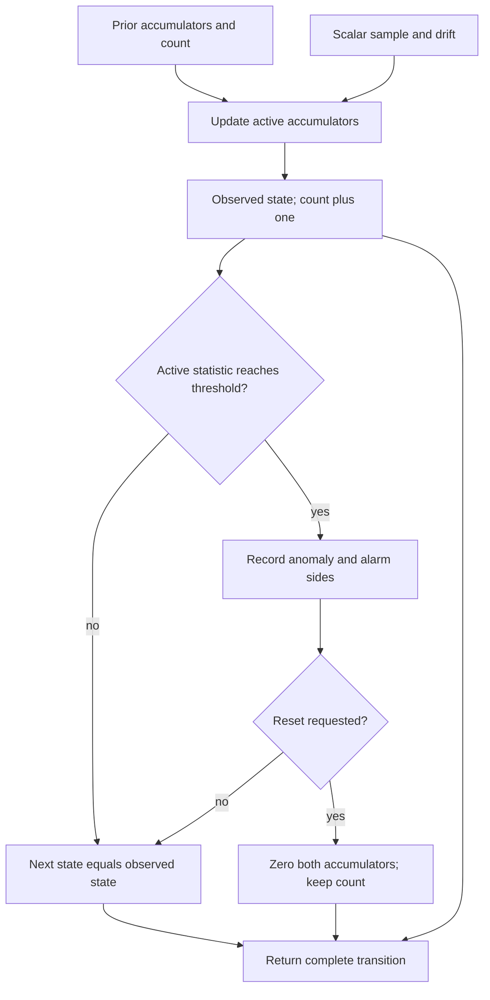

# Public numerical contract

## `evaluate_residual`

```python
evaluate_residual(
    residual,
    innovation_covariance,
    *,
    threshold,
    variable_order,
    source_ids,
) -> ResidualDiagnostics
```

| Input | Requirement |
| --- | --- |
| `residual` | Nonempty, finite, one-dimensional real numeric vector of length `n` |
| `innovation_covariance` | Finite, exactly symmetric, strictly positive definite real matrix with shape `(n, n)` |
| `threshold` | Finite positive real scalar; no default significance level |
| `variable_order` | `n` distinct nonempty strings, in residual and covariance row/column order |
| `source_ids` | One or more distinct nonempty source reference strings |

Strings, complex values, and boolean-only numerical arrays are rejected. Numerical arrays are copied into float64. Callers should supply typed real arrays rather than mixed Python containers. Inputs must already express consistent units and frames: covariance entry `(i, j)` has the product of coordinate `i` and coordinate `j` units. Variable labels document order; this API does not parse units or transform frames.

The immutable result contains copies of `raw_residual`, `innovation_covariance`, `variable_order`, and `source_ids`; the marginal normalized residual; the lower-Cholesky whitened residual; NIS; the threshold; and the status. Whitening coordinates depend on the declared variable order. Marginal normalized residuals are not generally independent.

`nis >= threshold` produces `statistical_anomaly`; otherwise the result is `nominal`. Invalid inputs and nonfinite numerical results raise `ValueError`. There is no covariance clipping, jitter, pseudoinverse, tolerance-based acceptance of asymmetry, or silently repaired covariance.

## `cusum_step`

```python
cusum_step(
    value,
    prior_state,
    *,
    drift,
    threshold,
    direction,
    source_ids,
    reset_on_alarm=False,
) -> CusumResult
```

`value` is a finite real scalar from one consistently defined stream. It can be a specified component of a normalized residual, but the API does not choose or normalize that stream. Values, drift, thresholds, and accumulator states must use compatible units. `drift` is finite and nonnegative; `threshold` is finite and positive. `direction` is `positive`, `negative`, or `two_sided`.

`CusumState(positive=0.0, negative=0.0, sample_count=0)` is an initial state. Accumulators are finite and nonnegative, and count is a nonnegative integer. Positive-only mode requires a zero negative accumulator, and negative-only mode requires a zero positive accumulator. Keep configuration and stream identity fixed across one sequential run; an intentional configuration change is a distinct declared run managed by the caller.

Each result preserves the raw scalar, source IDs, parameters, prior state, observed state before optional reset, next state, alarm sides, and status. A statistic at or above the threshold emits `statistical_anomaly`. With reset disabled, an accumulator can remain above the threshold and emit an anomaly on every affected sample; the result is not a latched or edge-triggered alarm.

With `reset_on_alarm=True`, **both** next-state accumulators are zeroed after an anomaly, while the incremented sample count is retained. `observed_state` preserves the statistics that crossed the threshold. To begin a new sequence with count zero, supply a new `CusumState()` and retain the sequence boundary externally.

No input is mutated. The caller chooses which returned `next_state` to carry forward and persists the transition if required. The module does not maintain hidden session state, consult wall-clock time, assign random identities, or store state globally.

## Explicit CUSUM transition and reset



Solid arrows show one current `cusum_step` call. The result keeps both the
threshold-crossing observed state and the next state, so a requested reset does
not erase the alarm evidence. The caller explicitly carries a returned next
state into another call; this diagram introduces no hidden session, persistence
or automatic response. Source references, any enclosing execution identity and
the resulting transition remain distinct from a separate verification claim.

## Limits of declared identity

Source IDs are preserved verbatim and validated for basic structure; existence and authenticity are not verified. Neither output status is a physical fault diagnosis. There is no public isolation API in this foundation.

## Optional SET export

`fdir.exchange.export_result` accepts explicit JSON mappings and validates the resulting artifact through SET's existing `result-artifact.v1` contract at source revision `bd261a765281a95312f7c91a3857233476294c5b`. The optional `exchange` dependency is pinned to that revision. Core numerical calls do not import SET.

The helper snapshots inputs and results, binds a deterministic content digest to the input payload, and includes operation, execution, declared source revision, applicability, model references, and calibration references in result identity. Callers supply execution identity and creation time; the helper does not read a clock. Execution identity changes result identity even for identical numerical inputs. JSON nonfinite values and colliding operation/execution/input identities are rejected.

The helper does not execute the operation or prove that a supplied result follows from a supplied input. Scientific mapping remains explicit and caller-owned. `examples/exchange.py` computes NIS first, then exports only that scalar as a component. Its output covariance is `not_applicable` because the example does not assert an uncertainty model for the diagnostic score; the original innovation covariance remains fully retained in the input and numerical result. Input covariance is never relabeled as score covariance.

`verification_refs` starts empty. Conformance validation is not independent verification, source attestation, evidence admission, or live CIW execution. The synthetic all-zero source revision in the example is a placeholder; operational callers must supply the revision appropriate to their declared execution and retain separate verification evidence.
