# Operation and result contract

## Typed numerical API

The public package is `oit`. Inputs are array-like real data, converted into
nonempty finite float64 matrices. Column order is explicit through mandatory
distinct nonempty `state_names` or `parameter_names`. Scales, when present, must
be positive finite vectors matching those columns.

`lti_observability` returns `ObservabilityResult`: state names/scales, coordinate
mode, horizon, raw observability matrix, analyzed matrix and `RankDiagnostics`.

`local_identifiability` returns `IdentifiabilityResult`: parameter names/scales,
coordinate mode, original sensitivity, whitened sensitivity, Fisher information,
`RankDiagnostics` and an explicit local scope string.

`RankDiagnostics` includes numerical rank, input dimension, full-column-rank
status, singular values, applied relative/absolute tolerances, reported threshold,
weak-direction tolerance, full-column condition number, retained-subspace
condition number, numerical-nullspace columns and weak-direction columns.

## Identity separation

| Identity | Meaning | Required integration treatment |
| --- | --- | --- |
| Evidence | Model/Jacobian/covariance sources, evaluation-point evidence and units | Preserve immutable source references and content identity |
| Operation | Requested algorithm, horizon, column order, scales and tolerances | Declare before execution; do not use a result hash as the operation identity |
| Execution | One run with package revision and numerical environment | Bind the run to its declared operation and exact inputs |
| Result | Returned numerical matrices and diagnostics | Bind to execution; retain numerical outputs and their coordinate meaning |
| Verification | Separate reference comparison or independent check | Identify verifier, check method and claimed scope separately |

The numerical API returns dataclasses, not admission decisions. Integrators must
provide external evidence and execution identities; a caller-provided identity
does not authenticate its source. The fixture replay is an example execution,
not proof that measurements or model assumptions describe a physical system.

## Existing SET exchange export

`oit.exchange.export_result` takes explicitly mapped JSON-compatible
`input_payload`, `numerical_result`, scalar `components`, covariance metadata,
operation/execution references, a caller-supplied revision, timestamp and evidence
references. It returns SET's existing `notation.instrument.result-artifact.v1`
artifact after validation by the optional source-pinned SET dependency. No new
parallel scientific-result envelope is introduced.

The computation extension retains complete mapped inputs, a content-only input
digest and full mapped numerical results. The result digest includes execution
identity, so two executions may share an input digest while producing distinct
result identities. The function snapshots caller inputs without mutation and
rejects nonfinite JSON values and collapsed operation/execution references.
It does not run the requested calculation or verify the scientific mapping.

For rank diagnostics, the example maps finite dimensionless scalar components
and uses covariance status `not_applicable`. Its method explicitly identifies
numerical diagnostics rather than an estimate. Nullspaces, singular values,
condition statuses, matrices and complete numerical inputs remain in the
computation payload. No posterior covariance is fabricated.

`source_revision_status` is `caller_supplied_unattested`; `verification_refs`
starts empty. Schema conformance validates structure, not provenance authenticity,
numerical correctness, CIW execution or ESM admission. The all-zero source
revision and evidence references in `examples/exchange.py` are synthetic fixtures.

## Serialization and replay

```mermaid
flowchart TD
    R["Returned matrices and rank diagnostics"] --> A["Map arrays to ordered JSON lists"]
    R --> C{"Condition value finite?"}
    C -->|"yes"| V["Keep numeric value"]
    C -->|"no"| N["Explicit null and condition status"]
    A --> P["Complete mapped numerical result"]
    V --> P
    N --> P
    I["Mapped inputs and distinct execution references"] --> E["Optional SET export and validation"]
    P --> E
    E --> O["Result artifact with empty verification refs"]
```

Solid arrows show the explicit mapping used by the example and the optional implemented exporter. Infinite condition values require a semantic JSON representation; no posterior covariance or independent verification is manufactured. The core numerical API itself returns dataclasses.

Use array `.tolist()` when adapting to JSON. Condition diagnostics can be
positive infinity; strict JSON adapters must represent them explicitly, such as
`{"value": null, "status": "not_full_column_rank"}`, rather than emitting
nonstandard `Infinity`. Preserve both the value semantics and rank metadata.
Hash a declared canonical representation if content identities are required;
NumPy's human-readable representation is not a serialization contract.

For reproducible replay, retain every input value, ordered name, coordinate
scale, tolerance, model/sample period context, evaluation point, package commit,
Python/NumPy/LAPACK environment and verification method. SVD sign or degenerate
subspace orientation changes alone do not establish a changed physical result.

Malformed inputs and rejected arithmetic raise `ValueError`; an SVD convergence
failure can raise `numpy.linalg.LinAlgError`. No partial result is returned.
