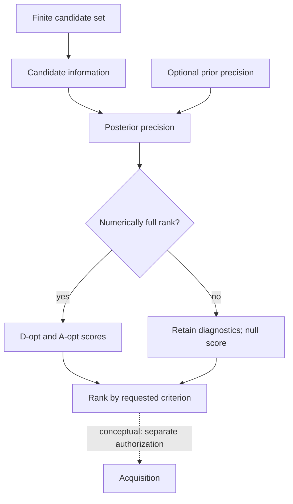

# Experiment Design and Sensor Placement Testbed

[Stack placement and ownership](docs/STACK.md) · [License](LICENSE)

A bounded mathematical instrument for ranking a finite set of supplied measurement candidates by their local information about explicitly declared parameters. Package: `edspt`. Status: executable synthetic reference operation, not a validated physical sensor-placement system.

The implemented operation, `finite-candidate-information.v1`, accepts a candidate ID, Jacobian, positive-definite noise covariance, and ordered parameter coordinates for every alternative. It forms each candidate's Fisher information with linear solves, adds an optional positive-semidefinite prior precision, and produces advisory D-optimal or A-optimal rankings with rank diagnostics.

For candidate `c`, the supplied local Gaussian model gives

\[
F_c = J_c^T R_c^{-1} J_c, \qquad \Lambda_c = \Lambda_0 + F_c.
\]

D-optimal ranking maximizes `log(det(Λc))`; A-optimal ranking minimizes `trace(Λc⁻¹)`. Both require numerically full-rank posterior precision. Singular candidates retain their information and rank diagnostics, have JSON `null` scores, and are not selected. If every candidate is singular, the selected ID is `null`. Equal computed scores are ordered by candidate ID.

## Finite alternatives and advisory selection



Solid arrows show current local information calculation and ranking for each
supplied alternative. Singular candidates remain in the result but cannot be
selected. The labelled dotted arrow is a conceptual downstream relationship;
an advisory selected ID does not start acquisition. See the
[system diagram atlas](https://github.com/giasonpooni/Computational-Instrumentation-Workbench/blob/main/docs/DIAGRAMS.md).

## Run

```bash
python -m pip install -e '.[test]'
python -m pytest
python examples/replay.py
```

Python 3.11 or newer and NumPy are required. CI exercises Python 3.11 and 3.12, including an optional exchange adapter against the source-pinned SET validator.

```python
from edspt import Candidate, ParameterCoordinate, rank_candidates

coordinates = (
    ParameterCoordinate("x", scale=1.0, unit="m"),
    ParameterCoordinate("y", scale=1.0, unit="m"),
)
result = rank_candidates([
    Candidate("single-axis", coordinates, [[1, 0]], [[1]]),
    Candidate("two-axis", coordinates, [[1, 0], [0, 1]], [[1, 0], [0, 1]]),
])
assert result.selected_candidate_id == "two-axis"
```

## System role

Observability and Identifiability Testbed (OIT) and Jacobian and Sensitivity Propagation Testbed (JSPT) can provide model diagnostics and Jacobians. This instrument evaluates explicitly supplied alternatives. The result is a proposed measurement for operator review. An authorized acquisition path can subsequently use Provenance-Preserving Data Acquisition (PPDA); this package neither commands equipment nor starts acquisition.

| Responsibility | Boundary |
| --- | --- |
| Candidate information | Uses caller-supplied Jacobians, noise models, and coordinate metadata |
| Ranking | Enumerates supplied candidates; returns scores and an advisory selection |
| Scientific validity | Requires external validation of model derivatives, noise, feasibility, and physical relevance |
| Execution authority | Remains with the operator and the governed execution system |

The instrument does not generate candidate locations, optimize over continuous geometries, perform cost or safety optimization, enforce a measurement budget, acquire data, estimate latent state, or certify placement quality. Materials experiments are a possible application of the same mathematics; no materials-specific experiment or model is implemented.

The Gaussian covariance must be parameter-independent at the supplied linearization. Noise may be correlated within a candidate block through its full covariance. Candidate measurement information must be independent of prior information before precision addition. All candidates and the prior must use exactly the same named, ordered, scaled parameter coordinates. Scores are coordinate-dependent; no parameter-unit invariance is claimed.

See [the contract](docs/CONTRACT.md), [numerical rules](docs/NUMERICS.md), and [stack role](docs/STACK_ROLE.md).

## Existing result exchange

```bash
python -m pip install -e '.[test,exchange]'
python examples/exchange.py
```

The optional adapter exports an explicit result mapping into the existing SET `notation.instrument.result-artifact.v1` contract and calls its validator, pinned to commit `bd261a765281a95312f7c91a3857233476294c5b`. The example performs an actual synthetic ranking and retains all candidate scores and singular statuses. Scalar count diagnostics use covariance status `not_applicable`; they are not assigned a fictional zero covariance. Evidence references, operation, execution, result, and verification identities stay distinct. The example's all-zero source revision is an explicitly unattested synthetic placeholder.

This establishes exchange conformance only. It is not native CIW execution, acquisition authorization, evidence admission, source attestation, or independent verification. Core numerical use does not require the exchange dependency.

## License

MPL-2.0. See [LICENSE](LICENSE).
