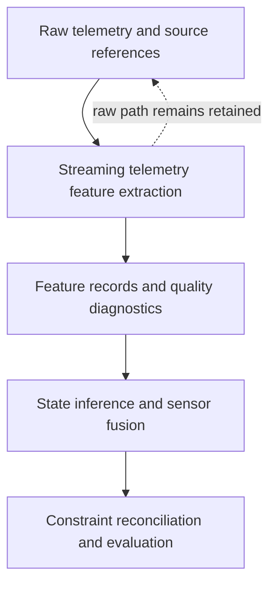

# Streaming Telemetry Feature Extraction

Part of **Notation Systems' computational instrumentation and evidence infrastructure** for industrial and cyber-physical systems.

[Stack map](https://github.com/giasonpooni/Computational-Instrumentation-Workbench/blob/main/docs/STACK.md) · [Component role](docs/STACK_ROLE.md) · [Draft contract](docs/CONTRACT.md) · [Implementation plan](docs/IMPLEMENTATION_PLAN.md)

**Causal and replayable conditioning of telemetry streams into spectral and temporal feature records with explicit signal-quality diagnostics.**

## Status

This repository is currently a **specification seed**. It contains the public
role, boundary, contract and validation plan for the instrument. It does not yet
contain a C++ stream operator, FFT/STFT implementation, NumPy reference,
Computational Instrumentation Workbench (CIW) adapter, executable schema
validator, benchmark, or test suite. Names in the contract and plan are
proposed interfaces until an implementation and conformance tests land.

## Responsibility

This instrument occupies the signal-conditioning boundary between retained raw
telemetry and downstream state inference:

Its intended transformation is:

\[
\text{TelemetryWindow}
\xrightarrow{\;\text{declared stream operation}\;}
\left(\text{FeatureRecord},\ \text{StreamQualityDiagnostic}\right).
\]

The component owns declared windowing, filtering, spectral transforms, temporal
feature extraction and stream-quality characterization. It does not own the
physical truth of a measurement, latent-state estimation, geometry, constraint
reconciliation, evaluation verdicts, evidence admission or operational control.

In particular:

\[
\text{AnomalyScore} \neq \text{VerifiedAnomaly}.
\]

An anomaly score or event marker is a derived diagnostic or candidate. Its
reliability must be evaluated under replay, degradation, drift and fault
injection before any downstream policy treats it as an established condition.

## Intended inputs and outputs

### Inputs

- ordered samples or sample blocks with channel identity and numeric values;
- event time, receipt time and an explicit clock or timebase declaration;
- unit, coordinate frame or sensor-axis declaration where applicable;
- source-observation and source-artifact references;
- calibration references and applicability intervals when calibration is used;
- explicit missingness, late-data and out-of-order indicators; and
- an operation request that fixes causal/offline mode and transform parameters.

### Outputs

- event-time support interval and processing time;
- channel, unit, frame and timebase;
- window length, hop, overlap and boundary policy;
- filter/transform configuration and implementation version;
- frequency coordinates or named temporal features in a declared order;
- sample count, missingness, late-data and warm-up status;
- quality metrics and uncertainty status;
- source observation, calibration, operation, execution and replay references;
- filter state identity when state persists across windows; and
- diagnostics such as candidate event markers or anomaly scores, explicitly
  separated from verified findings.

The detailed field and identity rules are in [the draft contract](docs/CONTRACT.md).

## Non-negotiable invariants

1. **Raw observations remain addressable.** A filtered value or derived feature
   never overwrites or silently substitutes for retained source telemetry.
2. **Causal and offline modes are distinct.** A causal result may depend only on
   samples available by its declared decision time. Offline or zero-phase
   processing must be labeled as non-causal.
3. **Time semantics are explicit.** Event time, receipt time, processing time,
   window support and clock basis are not collapsed into a single timestamp.
4. **Missing data is not zero.** Dropout, late arrival and imputation remain
   distinguishable, with the applied policy recorded.
5. **Configuration is part of result identity.** Window, overlap, transform,
   padding, normalization and filter state participate in replay identity.
6. **Unknown uncertainty remains unknown.** A missing covariance or error model
   is not represented as a zero matrix or exact result.
7. **Diagnostics do not become truth by naming.** Scores and thresholds produce
   candidates; verification and operational disposition remain separate acts.
8. **Execution and verification identities remain separate.** A successful run,
   digest or internal self-check is not independent verification.

## Position in the instrumentation stack

| Component | Responsibility at this boundary |
| --- | --- |
| [Provenance-Preserving Data Acquisition](https://github.com/giasonpooni/Provenance-Preserving-Data-Acquisition) | Retains source artifacts, observations, extraction lineage and explicit missingness. |
| **Streaming Telemetry Feature Extraction** | Conditions ordered telemetry into replayable features and stream-quality diagnostics while preserving source references. |
| [State-Inferential-Cortex](https://github.com/giasonpooni/State-Inferential-Cortex) | Intended downstream state estimation, fusion, trajectory reconstruction and posterior uncertainty; currently a separate specification seed. |
| [Geometric Telemetry Engine](https://github.com/giasonpooni/Geometric-Telemetry-Engine) | Owns declared geometry, coordinate frames, geodesic operations and tangent uncertainty. |
| [Constraint-Based State Reconciliation](https://github.com/giasonpooni/Constraint-Based-State-Reconciliation) | Reconciles estimated state against declared constraints without inventing those constraints. |
| [State Estimation Evaluation Testbed](https://github.com/giasonpooni/State-Estimation-Evaluation-Testbed) | Validates exchange artifacts and evaluates estimator behavior under declared degradation; it does not make measurements true. |
| [Scientific Computation Runtime](https://github.com/giasonpooni/Scientific-Computation-Runtime) | Executes declared scientific workloads and retains separate operation, result and verification records. |
| [Evidence and State Management](https://github.com/giasonpooni/Evidence-and-State-Management) | Governs evidence, versioned state, admission and release. Derived features have no direct canonical write authority. |
| [Computational Instrumentation Workbench](https://github.com/giasonpooni/Computational-Instrumentation-Workbench) | Will invoke, inspect and replay the instrument through an adapter after an executable contract exists. No adapter is implemented yet. |

These are responsibility boundaries, not a claim that the cross-repository
execution path is already implemented.

## Initial engineering slice

The first useful vertical slice is intentionally narrow:

1. a deterministic C++ streaming-window operator;
2. FFT/STFT operations with explicit normalization and frequency coordinates;
3. separate causal and offline modes;
4. declared late-data, dropout, padding and warm-up policies;
5. a typed feature-result and quality-diagnostic contract;
6. a NumPy reference implementation for differential comparison;
7. a Python adapter boundary suitable for CIW invocation;
8. replay fixtures proving causal outputs do not depend on future samples; and
9. State Estimation Evaluation Testbed fixtures for impulse, sinusoid, drift,
   dropout, jitter and out-of-order delivery.

The implementation sequence and acceptance gates are specified in
[docs/IMPLEMENTATION_PLAN.md](docs/IMPLEMENTATION_PLAN.md).

## Candidate applications

- RTK/GNSS signal-quality monitoring and cycle-slip-like candidate markers;
- IMU vibration, bias and oscillator characterization;
- industrial machine and process telemetry;
- structural and infrastructure monitoring;
- spectral fault-signature extraction;
- communications and quadrature-stream inspection; and
- measurement preconditioning before sensor fusion.

Application-specific detectors, thresholds and calibration remain outside the
generic public interface unless they can be stated and validated as reusable
operations.

## Repository identity and licensing

The repository was originally named `Telemetric-State-Stream-Filter`, while its
initial README used `Stream-State-Telemetry-Filter`. The technical repository
name is now `Streaming-Telemetry-Feature-Extraction`, which identifies the
component by its stable input/output responsibility rather than by a product or
estimator metaphor.

The rename does not mint a new observation, operation, execution, result,
verification or replay identity. Historical references remain historical; new
documentation should use the current repository location.

The initial repository revision was published under AGPL-3.0. Beginning with
this revision, material distributed from the current branch is licensed under
the [Mozilla Public License 2.0](LICENSE), consistent with the file-level
reciprocity policy for public Notation Systems instruments. Earlier distributed
revisions remain available under their original terms.
