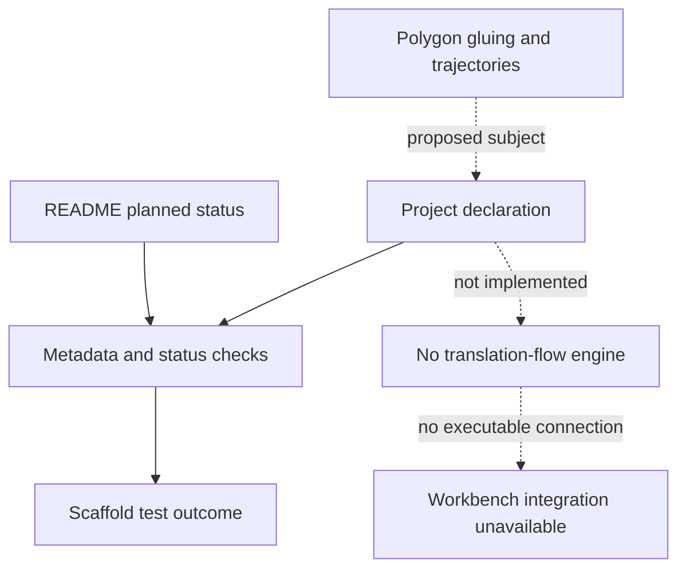

# Translation-Surface Dynamics Explorer

Part of **Notation Systems' computational instrumentation and evidence infrastructure** for industrial and cyber-physical systems.

[Stack map](https://github.com/giasonpooni/Computational-Instrumentation-Workbench/blob/main/docs/STACK.md) · [Component role and interfaces](docs/STACK_ROLE.md)

**Status: planned.** Research scaffold concerning polygon gluing and trajectory dynamics on compact translation surfaces.
This repository does not yet claim a dynamics implementation.

The current contents are a project declaration, scope documentation and scaffold
checks. Those checks validate repository metadata and status; they do not
validate a numerical algorithm or establish physical accuracy.

## Scaffold status and declared subject



Solid arrows show only the implemented scaffold tests. Dotted arrows mark the declared research subject and absent numerical boundaries. Passing metadata checks does not validate an algorithm, produce a scientific result or admit evidence into the workbench.

[Instrumentation diagram atlas](https://github.com/giasonpooni/Computational-Instrumentation-Workbench/blob/main/docs/DIAGRAMS.md).

## Check the scaffold

```sh
python -m unittest discover -s tests -v
```

See [scope and exclusions](docs/SCOPE.md) and
[contributor invariants](CONTRIBUTING.md).

## License

MIT. See [LICENSE](LICENSE).
