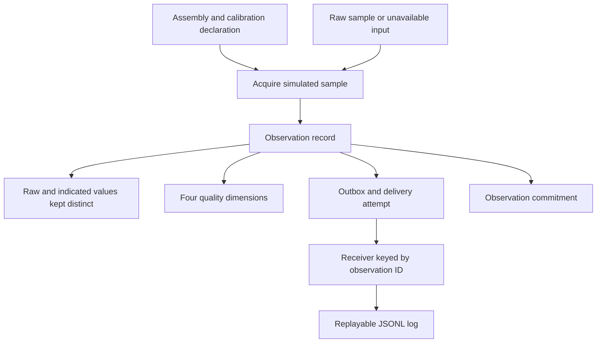

# Retrofitted Computational Instrumentation

Part of **Notation Systems' computational instrumentation and evidence infrastructure** for industrial and cyber-physical systems.

[Stack map](https://github.com/giasonpooni/Computational-Instrumentation-Workbench/blob/main/docs/STACK.md) · [Component role and interfaces](docs/STACK_ROLE.md)

Python host-side records for a declared measurement chain: assembly metadata,
raw observations, calibration, quality status, uncertainty and replayable logs.

## Implemented scope

The included example uses a simulated displacement bench. Its assembly declares
a LILYGO T-Display-S3 board profile, simulated bridge counts, an installation
binding and the prototype conversion `y = 0.01 * (raw - 0)` mm. This is host-side
software; no deployable acquisition firmware is included and electrical
compatibility is not inferred from the board declaration.

Raw observations and indicated values remain distinct. Acquisition, timing,
calibration and inference have separate status fields. A disconnected channel
produces unavailable values; a repeated delivery keeps the same observation
identity. The example's inference status is `not_run`.

## Host-side measurement workflow



Solid arrows describe the implemented host example. Missing acquisition remains
unavailable; retries preserve the observation identity while recording separate
delivery attempts. The commitment excludes delivery metadata. Calibration
parameters and uncertainty are declarations, and the example's inference status
remains `not_run`. See the [Instrumentation diagram atlas](https://github.com/giasonpooni/Computational-Instrumentation-Workbench/blob/main/docs/DIAGRAMS.md).

## Run

Use Python 3.12 or newer and [uv](https://docs.astral.sh/uv/):

```bash
git clone https://github.com/giasonpooni/Retrofitted-Computational-Instrumentation.git
cd Retrofitted-Computational-Instrumentation
uv run --python 3.12 --dev python -m pytest
uv run --python 3.12 python examples/displacement_bench.py
```

Alternatively, in an activated Python 3.12-or-newer environment:

```bash
python -m pip install -e . pytest
python -m pytest
python examples/displacement_bench.py
```

The example writes `results/displacement_bench.jsonl` and
`results/displacement_commitments.jsonl`. All observations are simulated.
[Reference digests](validation/rci-displacement-digests-v1.json) exercise the
record encoding; they are not field measurements. The separate
[`displacement_budget.py`](examples/displacement_budget.py) example exercises
explicit uncertainty-budget components.

## Record commitment interoperability

An `rci-evidence-commitment-v1` JSON record carries an observation digest. From
a separately installed CSE checkout, its experiment harness can bind that
commitment:

```bash
python -m gat.demo.experiment_harness \
  --disposition validation/beam-b1-disposition-v1.json \
  --commit path/to/rci-evidence-commitment.json \
  -o out/harness-bundle.json
```

The `gat` command and disposition fixture belong to that separate repository.
Binding a digest does not establish that the observation measures a beam,
material property, process pressure or another consumer-specific quantity.

## Contracts and limits

- [Measurement records and validation invariants](docs/KERNEL.md)
- [Implemented data flow](docs/MAP.md)
- [Invariant-corpus record](docs/invariant-corpus-cite-v1.md)
- [Validation status](validation/STATUS.md)

The conversion and uncertainty are declared prototype assumptions. Neither a
matching digest nor a successful computation establishes calibration
traceability, electrical compatibility, a certified device or physical truth.
JSPT is not imported by this host implementation. No hardware acquisition,
observer or proof runtime is supplied.
