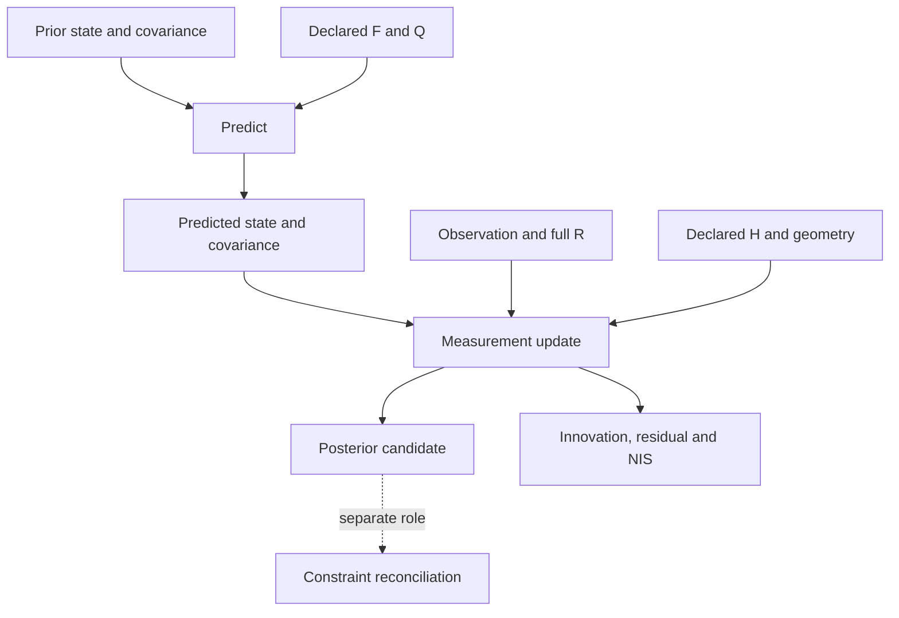

# Geometric State Inference Engine

A bounded state-estimation instrument in **Notation Systems' computational instrumentation and evidence infrastructure** for industrial and cyber-physical systems.

This project evolves the specification formerly titled **State-Inferential-Cortex** into a small executable estimator. It consumes declared observations, a prior, dynamics and geometry, and produces estimates with covariance, innovations, residuals and diagnostics. Its outputs are candidate estimates; downstream systems retain responsibility for reconciliation, verification, evidence admission and execution policy.

## Estimation workflow



Solid arrows show the implemented local calculation. The dotted connection names
an external responsibility; this package does not execute a CBSR handoff.
Innovation compares the observation with the predicted state; the residual uses
the posterior. Neither the posterior covariance nor NIS is a physical-validity
certificate. See the [Instrumentation diagram atlas](https://github.com/giasonpooni/Computational-Instrumentation-Workbench/blob/main/docs/DIAGRAMS.md).

## Implemented scope

| Capability | Status |
| --- | --- |
| Typed observations, priors and model contracts | Strict real numeric types, exact declared covariance symmetry, time/frame/unit checks; at most 64 components |
| Linear Gaussian estimation | NumPy Kalman prediction/update; linear solve and guarded Joseph covariance; exact binary64-rational fallback for cancellation-prone covariance |
| Manifold example | Scalar SO(2) heading, wrapped innovation and local tangent covariance in radians squared |
| Diagnostics | Innovation, innovation covariance, posterior measurement residual, normalized innovation squared |
| Reproducible examples | Synthetic scalar trajectory and angle-boundary example; numerical reference tests |
| Instrument exchange | Source-bound observation import, complete local numerical replay configuration and result export through the pinned SET validator; read-only CIW inspection |
| Identity separation | Predecessor/transition identities, occurrence-independent numerical-content digest, separate exchange artifact and execution reference |
| EKF/UKF, particle filters, factor graphs, SE(3), GNSS/IMU fusion | Not implemented |

The SO(2) example is a local Gaussian approximation for a concentrated angle distribution. It does not implement arbitrary manifolds or guarantee constraint satisfaction, observability, stability, accuracy, calibration traceability or real-time performance. Field reconstruction remains a possible specialization, rather than the definition of every state.

## Install and run

Use Python 3.11 or later from this repository root:

```sh
python -m pip install -e '.[dev]'
python examples/replay.py
python -m pytest -q
```

The examples use synthetic observations. See [the numerical contract](docs/NUMERICS.md) for assumptions and failure behavior, and [exchange setup](docs/EXCHANGE.md) for the optional cross-repository checks.

## Stack role

| Component | Responsibility and connection |
| --- | --- |
| [Provenance-Preserving Data Acquisition](https://github.com/giasonpooni/Provenance-Preserving-Data-Acquisition) | Retains source artifacts and observations; this estimator imports its shared observation format |
| **Geometric State Inference Engine** | Estimates state and model-conditional uncertainty from supplied observations and models |
| [Constraint-Based State Reconciliation](https://github.com/giasonpooni/Constraint-Based-State-Reconciliation) | Reconciles candidates against declared constraints; executable handoff is not implemented here |
| [State Estimation Evaluation Testbed](https://github.com/giasonpooni/State-Estimation-Evaluation-Testbed) | Owns evaluation; its pinned exchange checker validates this instrument's interchange records |
| [Evidence and State Management](https://github.com/giasonpooni/Evidence-and-State-Management) | Owns evidence/state admission and history; this instrument does not commit canonical state |
| [Scientific Computation Runtime](https://github.com/giasonpooni/Scientific-Computation-Runtime) / [Computational Instrumentation Workbench](https://github.com/giasonpooni/Computational-Instrumentation-Workbench) | Own execution orchestration and inspection; current connection is read-only exchange inspection |
| [Geometric Telemetry Engine](https://github.com/giasonpooni/Geometric-Telemetry-Engine) / [Curved-Surface Geodesic Sensitivity Runtime](https://github.com/giasonpooni/Curved-Surface-Geodesic-Sensitivity-Runtime) | Supply specialized geometry and coordinate operations through future explicit adapters |
| [Geospatial State Visualization](https://github.com/giasonpooni/Geospatial-State-Visualization) | Read-only projection; no direct renderer adapter is implemented here |

The estimator does not preserve raw sensor evidence, authorize calibration, issue stability certificates or execution warrants, operate actuators, or replace the workbench. Evidence references, declared operation identity, caller-supplied execution identity, result content identity and independent verification remain separate.

## Documentation

- [Architecture and authority boundaries](docs/ARCHITECTURE.md)
- [Numerical contract and API](docs/NUMERICS.md)
- [Exchange format and workbench inspection](docs/EXCHANGE.md)
- [Naming and compatibility](docs/NAMING.md)

## License

Current source, documentation and synthetic examples are **MPL-2.0**, unless a file says otherwise. See [LICENSE](LICENSE) and [NOTICE.md](NOTICE.md). Historical revisions retain their original license notices.
