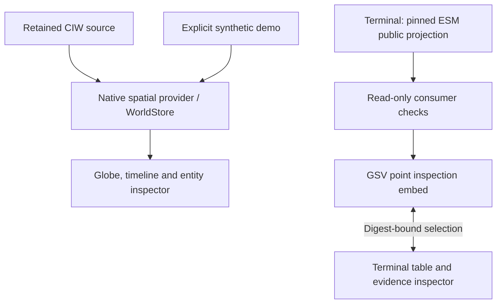

# Geospatial State Visualization

**Notation Systems — read-only geographic visualization for physical systems.**


*Existing synthetic client, retaining earlier display branding. This is not a
screenshot of the new ESM-record embed or a production deployment.*

GSV presents geographic entities, routes, flows and temporal state while keeping
source identity, evidence, time and geometry basis inspectable. It remains a
visualization client: no canonical evidence store, solver or admission authority
is introduced here.

## Three explicit inspection paths

| Entry | Input and behavior | Boundary |
| --- | --- | --- |
| **Standalone synthetic demo — `/`** | Facilities, road/rail/maritime/air routes, flows, timeline, inspectors, search and view commands. | Deterministic demonstration. Historical/current/forecast labels refer to the dataset's range, not a live service. |
| **Retained CIW context — `/?ciw=…&source=…`** | The existing `WorkbenchProvider` loads one explicitly selected retained geographic source into native validators and `WorldStore`. | Declared CRS84 facility points with complete constant state over an explicit interval. No local-frame conversion or invented state. |
| **Released-record embed — `/embed.html`** | Receives one pinned ESM `payload.projection.v1` through the companion Terminal's read-only bridge, rechecks source/time/digest bindings and synchronizes record selection. | Public fixtures only; literal WGS84 points. Polygon/extent declarations remain in the host inspector. No synthetic operational state is assigned to generic evidence records. |

The paths coexist. An ESM record is not relabelled as a CIW facility just to fit
a renderer. The embed reuses the existing engine and geographic convention,
while preserving the different record semantics at its input boundary.

## Inspect without changing what is being inspected



Record identity, source, knowledge time, validity and geometry basis stay attached.
View commands do not create evidence, execution, verification or admission
identities. A matching hash establishes consistency with a selected pin, not
physical accuracy, source authenticity or permission to publish.

The shared engine now supports container-relative sizing, removable frame
callbacks, `stop()`, `resize()` and idempotent `dispose()`. Existing standalone
window sizing remains compatible. The released-record embed disposes its own
geometry, materials, controls, listeners and canvas.

## Run and verify

Use Node.js 24 or newer for the existing native TypeScript test scripts.

```sh
git clone https://github.com/giasonpooni/Geospatial-State-Visualization.git
cd Geospatial-State-Visualization
npm ci
npm run dev -- --host 127.0.0.1
npm run check    # seam, provenance, native tests and strict types
npm run build    # the checks above, then both Vite entries
```

The seam check keeps `src/data/**` renderer-blind. Provenance checks require
source fields but do not certify their authenticity. Native tests check immutable
snapshot replacement, explicit time/unit boundaries and refusals. Released-record
tests additionally check exact pins, malformed geometry, private/authority
escalation, stale replacements and missingness. The new CI job runs the actual
built embed in Chromium; see its results rather than inferring browser success
from a passing contract test.

### Retained workbench source

Start CIW with an explicit origin, for example
`ciw serve --spatial-view-origin http://127.0.0.1:5173`. Retain its
`examples/workbench/geographic-context.json` using ordinary `source.add`, then open:

```text
http://127.0.0.1:5173/?ciw=ws://127.0.0.1:8765/spatial&source=source:sha256:YOUR_RETAINED_SOURCE_DIGEST
```

The read-only `/spatial` connection requires the configured origin. Catalog
changes do not switch the selected evidence. Disconnection leaves the retained
view available with offline status. See [CIW geographic view](docs/CIW_GEOGRAPHIC_VIEW.md)
for the exact source/descriptor checks and installed-workbench end-to-end test.

### Companion Terminal explorer

Build and serve this repository separately. Configure Terminal with this
build's exact `/embed.html` URL and an explicitly reviewed ESM projection pin.
No ESM credentials or private corpus data belong in this repository or the
browser bridge. Directly opening `/embed.html` without a host leaves it inactive.
See [released-record integration](docs/RELEASED_PROJECTION.md).

## Existing controls

Drag rotates the globe; wheel zooms; click selects. `/` focuses search and Space
toggles simulation playback. The standalone command bar supports `find`, `goto`,
`show`/`hide` layers, `show <commodity> flows`, `flows on/off`, `play`, `pause`,
`now`, `speed 1h/6h/24h`, `compare <a> vs <b>`, view presets and `help`.
`follow the load` runs the explicit synthetic scenario; `stop`/`exit` ends it.
These are view operations. The fixed-time ESM embed does not inherit simulation
playback or infer trajectories from a single released position.

## System responsibilities

| Component | Responsibility |
| --- | --- |
| GSV | Read-only geographic presentation and validated provider/record interfaces. |
| [Evidence and State Management](https://github.com/giasonpooni/Evidence-and-State-Management) | Evidence, versioned state, admission and release governance. |
| [Computational Instrumentation Workbench](https://github.com/giasonpooni/Computational-Instrumentation-Workbench) | Instrument sessions, adapters, execution and replay. |
| [Payload Terminal](https://github.com/giasonpooni/Payload-Terminal-V0) | Browser navigation, recorded-value comparison, synchronized table and evidence inspection. |

[Architecture](docs/ARCHITECTURE.md) · [Provider boundary](docs/PROVIDER_BOUNDARY.md) ·
[Stack role](docs/STACK_ROLE.md) · [CIW provider](docs/CIW_GEOGRAPHIC_VIEW.md) ·
[Released-record embed](docs/RELEASED_PROJECTION.md)

## Compatibility and license

The earlier repository name was `PayloadOS-Render-Engine`. Existing `payload-earth`
package naming, `window.payloadEarth`, CSS namespaces and retained record/runtime
identities remain compatible. A presentation change does not rewrite evidence.

GNU General Public License v3.0 — see [LICENSE](LICENSE).
