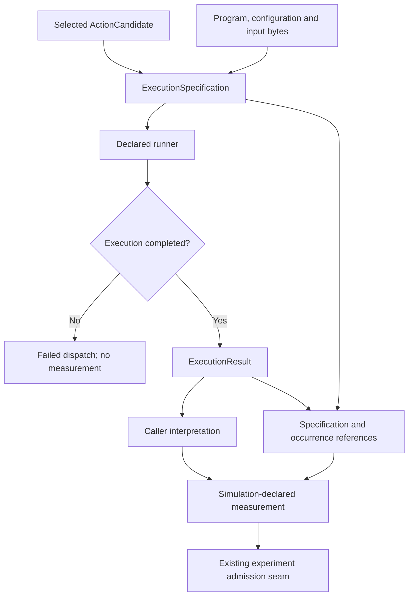

# Scientific Computation Runtime

Part of **Notation Systems' computational instrumentation and evidence infrastructure** for industrial and cyber-physical systems.

[Stack map](https://github.com/giasonpooni/Notations-Engineering-Terminal/blob/main/docs/STACK.md) · [Component role and interfaces](docs/STACK_ROLE.md)

**Versioned scientific state, declared computational workloads, and provenance-bearing execution.**

Scientific Computation Runtime is the scientific execution component of
Notation Systems' computational instrumentation stack. It combines explicit
computation specifications, checked engine dispatch, operation traces and
verification artifacts with the repository's existing evidence and
canonical-state capabilities. Attention is one workload within this runtime;
the runtime also supports heat diffusion, pairwise energy and structural
calculations.

The repository was previously named `Scientific-Transformer-Engine`. The
repository name describes its stable responsibility. Existing `ste.*` and
`scout.*` identifiers, Python package names, build recipes, schemas and saved
records retain their identities. See [documentation and compatibility](docs/README.md).

## Checked computation at a glance

Solid arrows show the implemented dispatcher path for a supported, available
runner. A declaration names the computation before execution; a completed
result is interpreted before it reaches the existing experiment admission seam.



The `DispatchedMeasurement` type does not assert that a physical measurement
occurred: this dispatcher marks its extraction as `simulation:`. Execution
history is retained in record bookkeeping rather than mixed into semantic
observation identity. Proof verification is a separate operation, not an
automatic effect of dispatch. See [the boundary diagrams](docs/STACK_ROLE.md#execution-records-and-state-projections)
and [Diagram atlas](https://github.com/giasonpooni/Notations-Engineering-Terminal/blob/main/docs/DIAGRAMS.md).

## Responsibility in the stack

| Component | Responsibility |
| --- | --- |
| [Scientific Computation Runtime](https://github.com/giasonpooni/Scientific-Computation-Runtime) | Specify, dispatch and record scientific computations; retain separate execution and verification identities. |
| [Provenance-Preserving Data Acquisition](https://github.com/giasonpooni/Provenance-Preserving-Data-Acquisition) | Acquire source material and produce observations with source identity, extraction lineage and explicit missingness. |
| [Evidence and State Management](https://github.com/giasonpooni/Evidence-and-State-Management) | Retain and govern evidence and versioned state through admission, review and release. |
| [Notations Engineering Terminal (CIW)](https://github.com/giasonpooni/Notations-Engineering-Terminal) | Operate and inspect instruments through the existing sessions, adapters and replay. |
| [Geospatial Systems Compiler (GSC)](https://github.com/giasonpooni/Geospatial-Systems-Compiler) | Separately maintained browser presentation and visualization project, formerly Payload Terminal V0; not a second scientific runtime or evidence authority. |
| [Geospatial State Visualization](https://github.com/giasonpooni/Geospatial-State-Visualization) | Present geographic entities, routes, flows and temporal state through a read-only globe interface. |
| [State Estimation Evaluation Testbed](https://github.com/giasonpooni/State-Estimation-Evaluation-Testbed) | Specify evaluation of reconstruction under noise, missing observations and latency; implementation status is tracked in that repository. |
| [Constraint-Based State Reconciliation](https://github.com/giasonpooni/Constraint-Based-State-Reconciliation) | Specify reconciliation against declared constraints and correction diagnostics; implementation status is tracked in that repository. |

These responsibilities describe component boundaries, not a claim that every
cross-repository adapter is implemented. Existing local evidence, retrieval and
compiler packages remain available. The local `workbench/` CLI is retained as a
repository interface; it is distinct from Notations Engineering Terminal, the
separate existing Computational Instrumentation Workbench (CIW). Numerical
engines attach through the execution seam, so their algorithms and arithmetic
remain explicit. Project titles do not rename runtime or contract identities.

## Implemented execution surface

| Capability | Implementation and limits |
| --- | --- |
| Declared computation | `execution/specification.py` commits to program, configuration and input bytes before a run. |
| Checked engine dispatch | `execution/engine.py`, `execution/dispatcher.py` and `crates/execution-cli/` provide native execution and result-identity checking, including batches. |
| Scientific workloads | Integer pairwise energy, 1-D heat diffusion, mass-weighted radius of gyration, periodic-lattice calculations and hardmax attention have explicit descriptors. Their arithmetic and bounds are part of each contract. |
| Structural inputs | `structures/` represents molecular/crystal inputs and lowers them into existing execution specifications. |
| External computation | `execution/gromacs.py` provides an external GROMACS boundary; availability requires the external executable. |
| Campaigns and verification | `campaign/` and `execution/proving.py` provide policy, warrant reuse and proof-backend integration. A proof applies only to its supported guest/program and checked statement; proof machinery does not certify every workload. |
| Attention-model workload | `transformer/` supplies integer hardmax-attention inference, including batched execution. Predictions remain distinct from admitted evidence. |
| Instrument-result exchange | `execution/instrumentation.py` exports result and verification artifacts with separate identities. Covariance claims retain frame, units and provenance; numerical covariance validity remains explicitly unchecked. |
| State and evidence | Immutable canonical state and derived projections coexist with the separate evidence/admission/retrieval path described below. |

The authoritative workload semantics are in the source descriptors and
corresponding tests. In particular, the integer pairwise reference is not the
same numerical model as a floating-point Lennard-Jones implementation in another
engine. See [engine seam](docs/ENGINE_SEAM.md),
[execution architecture](docs/RUST_EXECUTION_ARCHITECTURE.md), and
[attention workload](docs/TRANSFORMER_ENGINE.md).

## Identity and verification boundaries

A specification identifies a requested computation; an operation records an
occurrence; a result records what an execution produced; a warrant records a
verification artifact; an evidence identifier names admitted content. Repeating
a computation may reuse content identity while producing a distinct operation.
A repository rename changes none of those meanings.

Computed output is not a physical measurement. Verification establishes its
stated computational claim, subject to the backend and program contract; it
does not establish that input bytes describe the physical world. Reconciliation
and estimator integrations must enter through declared interfaces and existing
admission rules.

## Canonical-state compiler

An implementation of `docs/ARCHITECTURE_SPEC.md` ("Deterministic State
Architecture — Frozen Specification v1.0.0"): a canonical-state compiler
pipeline where a single, versioned, immutable **CanonicalState** is the
sole source of truth within that compiler, and every 3D view, diagram,
graph analysis,
simulation, or ML system downstream is a deterministic projection or
compilation of a frozen version of it — never a place state can be
written back from.

```
CanonicalState --> Schema/Validation --> StateProjection --> Morpho IR --> backends
   (source)          (frontend)           (pure fn)          (IR)      (Three.js, SVG,
                                                                          graph, sim*, neural*)
                                                                          * interface stubs only
```

For the canonical-state compiler, read `docs/ARCHITECTURE_SPEC.md` — it
is that subsystem's frozen contract. `docs/ARCHITECTURE.md`
explains how this codebase maps onto that contract, and
`docs/CONTRADICTIONS.md` documents three small internal inconsistencies
found in the spec's own grammar during implementation, and the minimal
fixes applied.

## Layout

```
core/canonical/     CanonicalState, Field, EdgeRecord, Version, VersionStore,
                     StateDelta, StateSchema, validate_candidate
core/projection/     project_state() / restore_projection()
morpho/               Morpho HDL: lexer, parser, AST, semantic IR, identity
                       model, provenance model, compile_morpho()
backends/threejs/       Morpho IR -> declarative Three.js scene descriptor
backends/diagram/        Morpho IR -> SVG document string
backends/graph/            Morpho IR -> descriptive graph metrics
backends/simulation/        interface/protocol shapes only (no engine)
backends/neural/              interface/protocol shapes only (no model)
runtime/                        feedback_loop.py: the only bridge from a
                                 simulation/neural candidate back into
                                 canonical state, and it goes through
                                 validate_candidate like everything else
evidence/                         the evidence pool: Source, Document,
                                   Record, Observation, Referent,
                                   ClaimedRelationship + a derived Trust
                                   Graph view. NOT core.canonical -- holds
                                   uncertain, conflicting, unreviewed data
                                   that never reaches CanonicalState in
                                   this codebase. See
                                   docs/SCOUT_ARCHITECTURE.md.
scout/                             SCOUT: the first external-intelligence
                                    primitive. Observes a source, extracts
                                    candidate evidence, attaches it to the
                                    evidence pool via evidence/admission.py
                                    -- never touches core.canonical. See
                                    docs/SCOUT_ARCHITECTURE.md for the full
                                    contract, network metrics, and FEP
                                    interface.
retrieval/                          deterministic, read-only retrieval over
                                     the evidence pool: RetrievalQuery ->
                                     RetrievalEngine -> RetrievalResult ->
                                     ContextPackage -> (seam only) future
                                     InquiryState. No embeddings, no vector
                                     search, no database -- exact/graph-
                                     traversal/text-substring lookup only.
                                     Never writes to evidence/ or
                                     core.canonical. See
                                     docs/RETRIEVAL_ARCHITECTURE.md.
adapters/                         interface.py: external-data -> CandidateDelta
                                   boundary (Protocol shape). NOT part of the
                                   original frozen spec's 23 sections --
                                   added on explicit request as a provisional
                                   extension; see docs/ARCHITECTURE.md.
                                   json_adapter.py / csv_adapter.py: real
                                   adapters (Phase 12) -- arbitrary JSON
                                   (nested objects, arrays, units/timestamps
                                   when supplied, relationships) and CSV
                                   (single-row and multi-row) normalized onto
                                   the same CandidateChange boundary. See
                                   docs/DATA_CAPABILITIES.md for exactly what
                                   is and isn't supported.
renderer/                        index.html: the only place a real
                                  THREE.* object is constructed
scripts/                          generate_sample_scene.py: demo data
tests/                             one file per architectural phase
                                    (test_canonical, test_versioning,
                                    test_delta, test_projection,
                                    test_morpho_compiler,
                                    test_backends_threejs,
                                    test_backends_diagram, test_replay),
                                    plus test_representation_equivalence.py
                                    (one canonical state -> multiple
                                    backends), test_live_state_bridge.py
                                    (delta/replay scenarios), test_adapters.py,
                                    test_data_ingestion.py (JSON/CSV -> field
                                    -> Morpho entity -> backend, and
                                    JSON/CSV/manual convergence),
                                    test_time_series_representation.py,
                                    test_architecture_boundaries.py,
                                    test_evidence_*.py / test_trust_graph.py /
                                    test_scout_*.py (the evidence pool, Trust
                                    Graph, network metrics, and SCOUT
                                    pipeline), and test_retrieval_*.py /
                                    test_context_package.py (RetrievalQuery/
                                    RetrievalResult/ContextPackage
                                    determinism, reproducibility, and
                                    read-only boundaries)
runtime/test_feedback_loop.py        kept colocated with the module it tests
                                      (verifies the "only validation.py may
                                      mint a Version" rule for the simulation/
                                      neural feedback path)
```

See `docs/DATA_CAPABILITIES.md` for the full data-type capability
matrix (SUPPORTED / PARTIALLY SUPPORTED / INTERFACE ONLY / NOT
IMPLEMENTED, with a test cited for every claim).

## Canonical state

`CanonicalState` holds `schema_version`, an immutable map of `Field`
(`id`, `type`, `value`, `unit`), and a tuple of `EdgeRecord` (explicit
relationships only — never inferred). `Field.id` must equal its own
dictionary key; a mismatch raises, it is never silently corrected.
Everything is a frozen dataclass over an immutable mapping, so "updating"
state always means "produce a new `CanonicalState`."

## Versioning

`Version.id` is a SHA-256 hex digest of `(schema_version, fields, edges)`
only — `id`, `parent`, `provenance`, and `timestamp` are excluded from the
hash. Two states with identical content always get the same id, from any
process, regardless of dict/set iteration order (verified in CI-style
checks across multiple `PYTHONHASHSEED` values — see the implementation
report). The genesis `Version` is the only one ever built outside the
validation pipeline; every later `Version` comes from
`validate_candidate`.

## Deltas

`diff(old, new, provenance)` produces path-addressed, leaf-level
`Change`s (`fields.mass.value`, `edges[0].type`, ...) with `add` /
`remove` / `replace` operations, in deterministic sorted order. `move`
and `rename` are reserved in the `Operation` type but never emitted in
v1.

## Validation: the one door into a new version

```
candidate --> schema validation --> constraint validation --> accept --> new Version
                    |                        |
                    +---- fail: reject, no state/version is touched ----+
```

`validate_candidate` in `core/canonical/validation.py` is the **only**
function in the whole codebase that can produce a new `CanonicalState` or
`Version`. Nothing in `morpho/`, `backends/`, or `renderer/` imports it or
anything capable of reaching it directly — see
`tests/test_architecture_boundaries.py` and the module-boundary checks
noted per-file below.

## Morpho: the intermediate representation

Morpho HDL is a small, human-readable, domain-neutral IR — entities,
relations, coordinate frames, groups, and constraints, each carrying
explicit provenance. `morpho/lexer.py` and `morpho/parser.py` implement
its grammar (`docs/ARCHITECTURE_SPEC.md` §7, as corrected by
`docs/CONTRADICTIONS.md`); `morpho/ir.py` is its semantic model;
`morpho/compiler.py::compile_morpho` is the pure, deterministic canonical
compilation path (`ProjectedState -> MorphoDocument`).

**Graph semantics.** Every `MorphoRelation` carries two independent flags:
`is_canonical` (was it backed by a real `CanonicalState.edges` entry?) and
`inference_status` (`"explicit"` or `"inferred"`). It is structurally
impossible to construct one with `is_canonical=True` and
`inference_status="inferred"` — the dataclass itself raises. Nothing in
`backends/` or `morpho/` has a code path back into `CanonicalState.edges`,
so an inferred relation can never silently become canonical.

**Identity.** `morpho/identity.py`'s four functions
(`node_id`/`cell_id`/`visual_id`/`geometry_id`) are all the identity
function on `field_name` in v1 — no hashing, no UUIDs, no namespacing.
They exist as separate named functions specifically so a future schema
version can change one without touching call sites.

## Backends

- **`backends/threejs/compiler.py`** — `compile_threejs` returns a plain,
  JSON-serializable `ThreeJSSceneDescriptor` (`geometries`, `materials`,
  `meshes`, `hierarchy`). It never constructs a `THREE.*` object.
- **`backends/diagram/compiler.py`** — `compile_svg` returns a complete,
  deterministically laid-out SVG document string.
- **`backends/graph/analysis.py`** — descriptive graph metrics
  (node/edge counts, adjacency, degree) over whatever the IR already
  contains; it does not itself invent inferred relations.
- **`backends/simulation/interface.py`**, **`backends/neural/interface.py`**
  — protocol/dataclass shapes only, per §16/§17. No engine, no model.

## Renderer

`renderer/index.html` is the only file in the repository that constructs
a real `THREE.*` object. It fetches a `ThreeJSSceneDescriptor` (see
`scripts/generate_sample_scene.py` for how one is produced) and keeps a
`geometry_id`/`visual_id`-keyed cache so that a value-only change updates
existing `THREE.Mesh` objects in place rather than recreating them, and so
a deleted entity's mesh is removed from the scene. It has no import, fetch
target, or code path back into canonical state — see
`tests/test_backends_threejs.py::test_renderer_html_never_references_canonical_mutation_endpoints`.
three.js itself is vendored at `renderer/vendor/three.module.js` (MIT
licensed) so the page has no runtime dependency on an external CDN.

## Feedback loop

`runtime/feedback_loop.py` is the only bridge from a simulation
`CandidateNextState` or a neural `BeliefState` back toward canonical
state, and it does so by handing the candidate to `validate_candidate` —
the same function a manual edit goes through. There is no alternate fast
path.

## Determinism

Every "compiler stage" function (`project_state`, `compile_morpho`,
`compile_threejs`, `compile_svg`) is a pure function of its inputs: no
wall-clock reads, no randomness, no reliance on dict/set iteration order
(iteration is always over explicitly `sorted()` keys where order is
observable in output). Verified by running the same pipeline under
multiple `PYTHONHASHSEED` values and asserting identical output.

## Running the tests

The full suite includes native/external-engine and proof-backend checks; those
require the binaries, toolchains and artifacts described in the relevant execution
documents. The release workflow verifies the two derived distributions and does
not certify the entire runtime. See [verification scope](docs/README.md#releases-and-verification-scope).

```
pip install pytest
python3 -m pytest
```

Tests live in `tests/`, one file per architectural phase (`test_canonical`
= Phase 1, `test_versioning` = Phase 2, `test_delta` = Phase 3,
`test_projection`/`test_replay` = Phase 4, `test_morpho_compiler`
= Phases 5-6, `test_backends_threejs`/`test_backends_diagram`
= Phases 7-8), plus `test_architecture_boundaries.py` for the dependency-
direction audit. `runtime/test_feedback_loop.py` stays colocated with
`runtime/feedback_loop.py` since it verifies that module's specific
invariant (Phase 10). This mirrors the flat `tests/` tree requested for
this build; `docs/ARCHITECTURE_SPEC.md` §21 originally specified a
colocated-per-module layout instead -- both cover the same 18 acceptance
tests plus additional coverage, this is a file-organization choice, not
an architectural one.

## Generating the demo scene

```
python3 scripts/generate_sample_scene.py
```

Writes `renderer/scene_v1.json` and `renderer/scene_v2.json` (the same
entities after one accepted value-only update), then open
`renderer/index.html` via a local HTTP server (not `file://`, since it
`fetch()`es the descriptor) and use the two buttons to switch between
them.

## License

Copyright 2026 Bespoke Polymer Inc. Licensed under the [Apache License, Version 2.0](LICENSE).