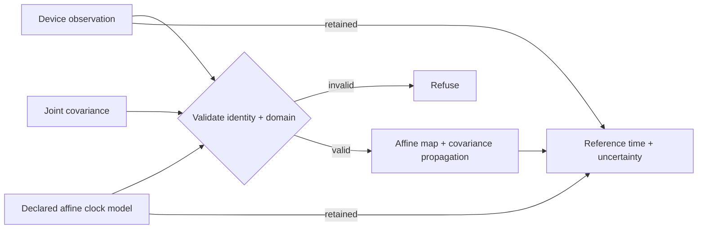

# Notations ClockSync

**Reconcile device event timestamps into a declared reference clock while retaining source identity, model provenance, and timing uncertainty.**

ClockSync is a small Notation Systems computational instrument. It is deliberately bounded: callers supply an affine clock model and joint covariance; ClockSync validates the declared domain, maps the timestamp, propagates first-order uncertainty, and returns a replayable result.

| Surface | Identity |
| --- | --- |
| Product | **ClockSync** |
| Installed command | `clocksync` |
| Python distribution | `notations-clocksync` |
| Stable Python import | `tbrt` |
| NET operation | `time.sync` |
| Core API | `reconcile_time` |
| Numerical boundary | Positive-skew affine clock map + first-order joint-covariance propagation |

The historical TBRT/`tbrt` implementation identity is retained so existing imports and versioned operation IDs do not change merely because the public tool is now easier to discover.

## What it computes

For an anchored affine clock model,

\[
t_\mathrm{ref}
=
t_{\mathrm{ref},0}
+
a(t_\mathrm{device}-t_\mathrm{device},0)
+
b,
\]

ClockSync propagates uncertainty from the ordered variables

\[
[t_\mathrm{device},a,b]
\]

using

\[
\sigma^2_{t_\mathrm{ref}} = J\Sigma J^T,
\qquad
J=[a,\ t_\mathrm{device}-t_\mathrm{device},0,\ 1].
\]

The implementation preserves covariance cross-terms and retains the original observation, clock model, reference origin, Jacobian, and supplied joint covariance in the result.



## Install

Python 3.11+ and NumPy are required.

```bash
python -m pip install -e '.[dev]'
```

The package installs the `clocksync` command while retaining the `tbrt` Python import.

## CLI

Run the supplied synthetic example:

```bash
clocksync examples/clocksync.json
```

Compact machine-readable output:

```bash
clocksync examples/clocksync.json --compact
```

Standard input is supported:

```bash
cat examples/clocksync.json | clocksync -
```

The JSON boundary uses explicit source/reference frame identities, one timestamp observation, one supplied affine model, and a 3×3 joint covariance matrix. Invalid models, mismatched frames, non-PSD covariance, extrapolation outside the declared model interval, and non-finite arithmetic fail closed.

## Python API

```python
import numpy as np
from tbrt import (
    AffineClockModel,
    ClockFrame,
    TimestampObservation,
    reconcile_time,
)

device = ClockFrame("sensor-1", "device-monotonic", "s")
reference = ClockFrame("reference-1", "reference-monotonic", "s")

raw = TimestampObservation(
    device_time=103.0,
    frame=device,
    evidence_id="observation-17",
)

clock = AffineClockModel(
    model_id="clock-map-4",
    source_frame=device,
    reference_frame=reference,
    device_origin=100.0,
    reference_origin=1000.0,
    skew=1.00002,
    offset=0.0003,
    valid_device_interval=(100.0, 110.0),
)

covariance = np.diag([1e-6, 1e-10, 4e-6])

result = reconcile_time(
    raw,
    clock,
    covariance,
    expected_reference=reference,
)

print(result.event_time)
print(result.standard_uncertainty)
```

For a JSON-compatible programmatic boundary, use:

```python
from tbrt.cli import reconcile_payload
```

This executes the same core reconciliation path used by the CLI.

## Deterministic replay

```bash
python examples/replay.py
```

`replay_reconciliation` recomputes a retained reconciliation without reading wall-clock state. The result retains the information required for deterministic numerical replay.

## Optional SET exchange

```bash
python -m pip install -e '.[dev,exchange]'
python examples/exchange.py
```

`tbrt.exchange.export_result` exports `notation.instrument.result-artifact.v1` against the source-pinned State Estimation Testbed contract. Export conformance is not independent verification and does not imply NET execution or evidence admission.

## Scope

ClockSync **does**:

- preserve clock/time-scale/unit identity;
- retain the original event observation;
- apply a caller-supplied anchored affine clock map;
- enforce the supplied applicability interval;
- propagate a full joint covariance with cross-terms;
- expose the result through Python and JSON/CLI boundaries;
- support deterministic replay.

ClockSync **does not**:

- estimate or fit clock models;
- modify device clocks;
- implement NTP/PTP/GNSS synchronization protocols;
- perform UTC/TAI/GNSS leap-second conversion;
- resample or reorder telemetry streams;
- infer missing timestamps;
- authenticate synchronization evidence;
- admit evidence or authorize downstream actions.

Source event time, receipt time, and knowledge time remain separate identities.

## Verification

```bash
python -m pip install -e '.[dev,exchange]'
python -m pytest
python examples/replay.py
python examples/exchange.py
clocksync examples/clocksync.json --compact
```

CI executes this surface on Python 3.11 and 3.12.

## Stack role

ClockSync is a provider instrument beneath the Notations Engineering Terminal. NET owns operation composition and dispatch; ClockSync owns declared clock mapping and timing uncertainty. It can provide aligned event-time coordinates to downstream filtering, estimation, geospatial, calibration, or telemetry workloads without becoming an evidence store or control system.

[Notations Engineering Terminal](https://github.com/giasonpooni/Notations-Engineering-Terminal) · [Stack placement](docs/STACK.md) · [Contract](docs/CONTRACT.md) · [Numerics](docs/NUMERICS.md) · [License](LICENSE)

License: MPL-2.0.
