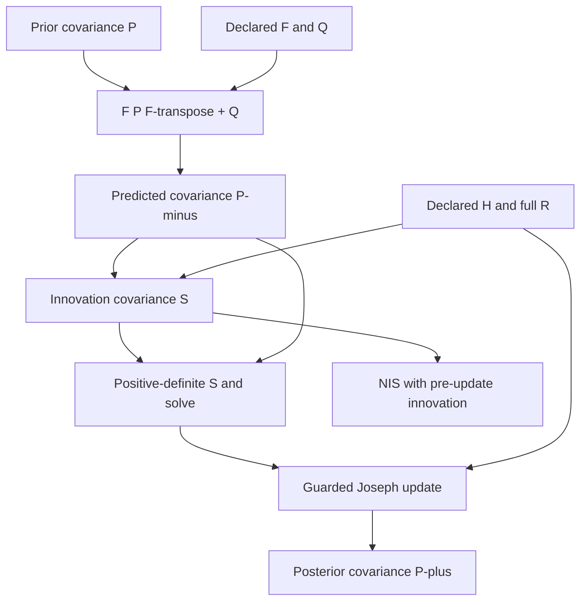

# Estimator boundaries

The engine implements a bounded numerical operation:

\[
(y_{0:T}, x_0, P_0, \mathcal M, \mathcal D, \mathcal G)
\longmapsto
(\hat x_{0:T}, P_{0:T}, \nu_{0:T}, r_{0:T}, \text{diagnostics}).
\]

Each output is conditional on the supplied model, covariance and frame declarations. The current implementation supports linear dynamics/measurements and scalar SO(2) local updates. Constraints beyond this supported angle geometry belong to explicit external models or reconciliation operations. There is no general constraint solver.

## Data flow

1. Acquisition retains evidence and constructs observation artifacts.
2. The adapter validates a supplied artifact against the pinned public exchange contract, retaining observation and receipt times separately.
3. The operator supplies the prior, models and compatible coordinate/unit declarations.
4. Prediction and measurement updates produce a candidate state and diagnostics.
5. The adapter emits a result artifact with full covariance, declared input/model references and a caller-supplied execution reference.
6. A workbench can inspect that artifact. Reconciliation, independent evaluation and canonical-state admission are separate operations.

No arrow implies an unimplemented live service or native workbench execution adapter. The exercised connection is the public exchange format and CIW's read-only inspector.

## Covariance through prediction and update

The covariance edges describe local numerical dependencies. Prediction advances
the declared time; update requires matching observation time, frame and unit
metadata. Computed covariance sums use the guarded arithmetic described in
[NUMERICS.md](NUMERICS.md); unsupported or singular innovation updates are
refused rather than regularized. Full within-vector covariance is retained.
Measurement independence from the prior remains a supplied model assumption,
and unknown cross-dependence cannot be inferred from this graph.

Transition identity binds predecessor and configuration. Numerical-content
identity, exchange-result identity and caller-supplied execution identity remain
separate, as specified below; repeating this computation is not independent
verification. See the [Instrumentation diagram atlas](https://github.com/giasonpooni/Computational-Instrumentation-Workbench/blob/main/docs/DIAGRAMS.md).

## Identity separation

| Identity | Meaning | Authority here |
| --- | --- | --- |
| Source evidence / observation reference | Declared source for values | Preserved; external provenance is not authenticated |
| Operation reference | Versioned mathematical operation | Declared by this package |
| Execution reference | Caller-identified invocation | Supplied externally; no execution warrant is issued |
| Result content identity | Hash of the serialized result | Recomputed for integrity; does not prove correct execution |
| Verification identity | Separate evaluation of a subject | Never invented by the estimator |

The public package contains reusable mathematical code and synthetic fixtures. Customer data, calibration profiles, deployment credentials, private operational state and control policy are outside this repository.

## Extension seam

Add estimator families and geometries with explicit state dimensions, chart/retraction conventions, process/measurement covariance bases and numerical references. Preserve existing operation and artifact identities when their semantics remain unchanged; introduce new versions when semantics change. Existing raw observations remain immutable inputs.

GNSS/IMU fusion requires additional models for coordinate frames, time synchronization, sensor extrinsics, gravity, biases, receiver clocks and observation quality. RTK additionally requires carrier-phase ambiguity handling and correction data. None of these mechanisms follows automatically from the current angle example.
