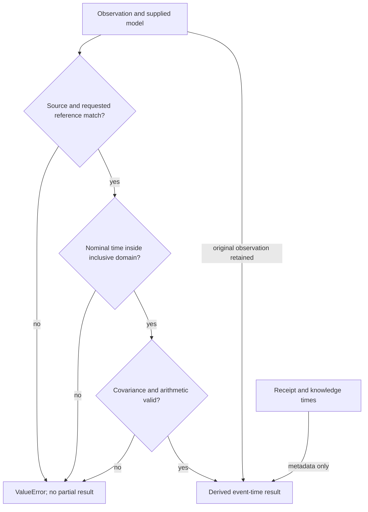

# Operation contract

## Inputs

| Object | Required content | Meaning |
|---|---|---|
| `ClockFrame` | `clock_id`, `time_scale`, `unit='s'` | Explicit coordinate identity; identical clock names with different scales do not match. |
| `TimestampObservation` | `device_time`, `frame`, `evidence_id` | Original finite numerical event timestamp and its evidence reference. |
| Optional receipt metadata | `received_at: TimePoint` | When a receiver recorded receipt, in its explicitly supplied frame. |
| Optional knowledge metadata | `known_at: TimePoint` | When a system recorded knowledge, in its explicitly supplied frame. |
| `AffineClockModel` | Model ID, both frames, both anchors, skew, offset, inclusive domain | Supplied numerical relation and applicability. |
| `joint_covariance` | Finite, symmetric PSD 3×3 array | Covariance in the exact order `[device_time, skew, offset]`. |
| `expected_reference` | Optional `ClockFrame` | Refuse an unintended output coordinate frame. |

The raw numeric timestamp is converted to binary64 on observation construction; raw lexical representations, integer ticks, source bytes, and acquisition records remain the upstream acquisition instrument's responsibility. Use an upstream declared conversion for other units.

Both anchors are fixed. Their uncertainty must be handled in an appropriate supplied joint model rather than silently assumed to be represented here. The source and reference time-scale labels may differ only because the caller supplies a bounded empirical mapping. A label such as `UTC` does not activate a standards-based conversion or permit extrapolation across a discontinuity.

## Result

`ReconciledTimestamp` retains the original observation and model, `event_time_delta`, `variance`, `jacobian`, validated covariance snapshot, and propagation version. The `reference_origin` and `reference_frame` properties resolve from the retained model. The derived standard uncertainty is `sqrt(variance)`, in seconds.

`event_time` is the rounded scalar sum of reference origin and delta. Receipt and knowledge timestamps remain in the original observation; neither is replaced by the reconciled event time or automatically compared across frames.

All contract records are frozen dataclasses. Covariance is copied and stored in nested tuples without repair. The strict symmetry requirement and PSD tolerance are described in [NUMERICS.md](NUMERICS.md).

## Failures

Solid arrows show the implemented rejection path and returned-data dependencies. Receipt and knowledge instants never substitute for event time. The covariance and arithmetic node summarizes the checks in the numerical contract.

Validation failures raise `ValueError`. A rejected call returns no corrected observation. There is no fallback to source time, hidden model extension, clock relabeling, regularization, or state mutation.

## Identity boundaries

| Identity | Responsibility |
|---|---|
| Evidence | The observation's `evidence_id` refers to upstream source material; TBRT does not certify it. |
| Model | `model_id` references the supplied map; its full parameters remain in the result. |
| Operation | The numerical operation is affine reconciliation with `first-order.v1` propagation. |
| Execution | A runner's invocation identity belongs to the execution record, independently of observation/model IDs. |
| Result | A result's content identity belongs to its serialized result record. It is not an execution ID. |
| Verification | A verifier's independent record binds the inspected inputs/result. Numerical success is not verification identity. |

The core numerical API does not conflate these references or manufacture verification/admission status. A caller can serialize dataclasses with `dataclasses.asdict`; the runnable example demonstrates a plain synthetic record.

The optional `tbrt.exchange.export_result` helper binds a complete JSON `input_payload`, complete `numerical_result`, explicit component mapping, and declared covariance into SET's existing `notation.instrument.result-artifact.v1`. It snapshots mutable caller data, computes a content digest for inputs, and keeps operation, execution, referenced artifacts, and result identities separate. Result identity includes execution identity. Its source revision is explicitly marked caller-supplied and unattested; `verification_refs` is empty. Validation is contract conformance, not independent verification or operational integration.

The export example uses `event_time_delta` in seconds with `[[variance]]` as covariance and retains the reference origin plus clock/time-scale identities in the full numerical result. The caller-supplied `created_at` is artifact metadata; it never replaces the reconciled event time. Install `requirements-exchange.txt` to use the source-pinned validator. The `exchange` extra is now only a compatibility marker; see the [publishing and migration notes](PUBLISHING.md).
