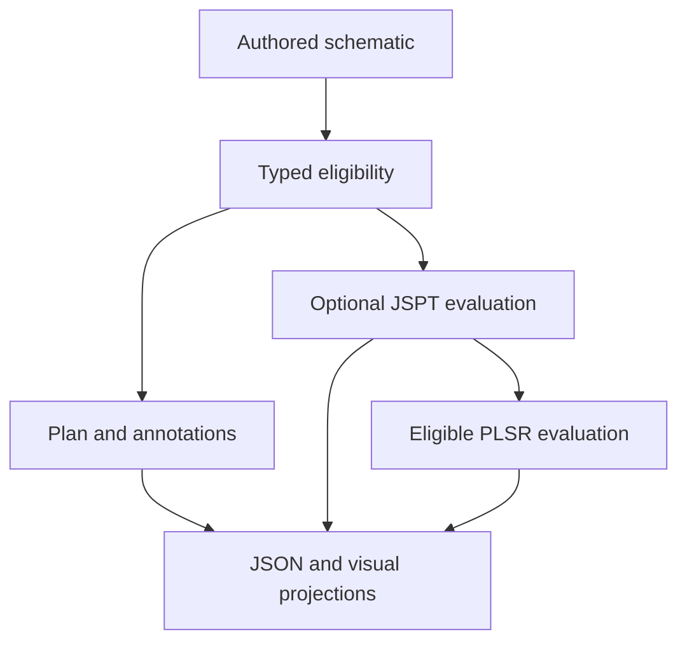

# Schematic retrieval and numerical routing

SRA validates an authored schematic, retrieves typed subgraphs and records
eligibility. Explicit call options invoke available pinned numerical adapters;
planning alone emits unchecked events.

RCI digest or record binding retains an explicit measurement relationship.
It does not perform acquisition. A fixture linearization remains tagged as a
fixture and cannot qualify the live JSPT-to-PLSR path. Eligibility and numerical
annotations grant no authority to operate equipment or admit physical state.

See [kernel boundary](KERNEL.md), [scope](SCOPE.md) and [stack role](STACK_ROLE.md).
