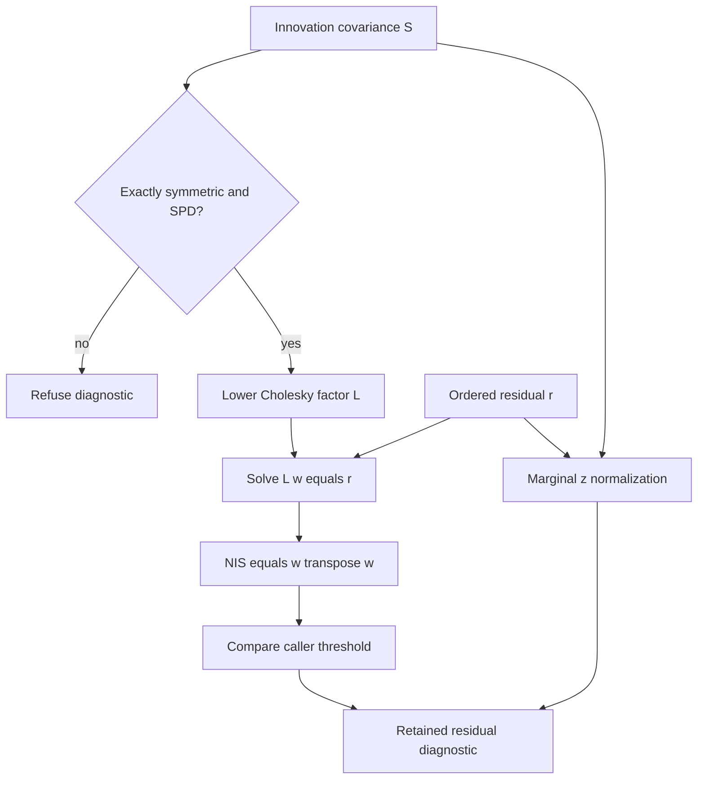

# Numerical definitions and checks

## Residual diagnostics

Let `r` be the supplied innovation/residual column vector and `S` its supplied innovation covariance, both in the same ordered coordinates. The package computes the lower Cholesky factor `L`, solving:

```math
S = LL^T, \qquad Lw = r,
\qquad \mathrm{NIS} = w^T w = r^T S^{-1}r.
```

The inverse shown in the mathematical definition is never formed by the implementation. Marginal normalization is computed separately:

```math
z_i = \frac{r_i}{\sqrt{S_{ii}}}.
```

When off-diagonal covariance is present, summing `z_i²` generally does not equal NIS. Lower-Cholesky whitening also depends on the coordinate order; compare NIS across consistent permutations, and preserve ordering when interpreting whitened components.

Under a correctly specified nonsingular Gaussian innovation model, an appropriate NIS distribution can support probability-based threshold selection. This API does not establish those assumptions or infer a confidence probability. The caller explicitly chooses a positive threshold. An NIS crossing can arise from model mismatch, covariance miscalibration, outliers, numerical errors upstream, or a physical fault; this test does not distinguish those causes.

## Correlated innovation and marginal diagnostics



Solid arrows show the current calculation. Marginal normalization and joint
whitening are distinct branches: correlated marginal components cannot be
squared and summed as a replacement for NIS. Invalid covariance refuses the
entire diagnostic. The result retains the source IDs, ordered inputs, score and
threshold; source identity is preserved rather than authenticated.

## Covariance admissibility

The package checks exact symmetry and uses Cholesky factorization to reject singular or indefinite covariance. It has no absolute symmetry tolerance that could admit a tiny-scale invalid covariance. For example, `[[1e-200, 2e-200], [2e-200, 1e-200]]` is indefinite and is rejected, while a positive definite covariance at the same scale is admissible when the resulting calculation is representable.

Inputs with roundoff asymmetry require an explicit upstream decision and a separately recorded transformation. There is no automatic averaging, eigenvalue clipping, ridge term, or covariance inflation.

Computation uses NumPy float64. Factorization success is numerical admissibility, not evidence of good conditioning or physical calibration. Very ill-conditioned covariance can make diagnostics sensitive to perturbations. Overflow and nonfinite outputs raise `ValueError`; float64 roundoff and underflow limitations still apply. No cross-platform bit-for-bit equivalence is claimed for linear algebra results.

## Sequential CUSUM

For a scalar input `x_t`, nonnegative declared drift allowance `k`, and positive threshold `h`, the active accumulators are:

```math
C_t^+ = \max(0, C_{t-1}^+ + x_t - k),
\qquad
C_t^- = \max(0, C_{t-1}^- - x_t - k).
```

The positive or negative channel can be selected alone, or both can be active. A channel crossing is inclusive: `C_t >= h`. The input is expected to have whatever reference centering the caller intends. There is no estimated baseline, hidden recentering, averaging window, cadence normalization, or automatic drift selection.

A threshold crossing is reported before any requested reset. Explicit post-alarm reset clears both accumulators and keeps the sample count. Sequential input order, stream definition, configuration, and reset history are part of the operation's meaning. The package imposes no stochastic independence assumption merely by accepting a stream, and makes no false-alarm-rate guarantee.

## Analytical verification

Tests include:

- Scalar `r=6`, `S=9`: whitened residual `2`, NIS `4`, inclusive threshold behavior.
- Correlated `r=[2, 3]`, `S=[[4, 2], [2, 5]]`: `L=[[2, 0], [1, 2]]`, whitened residual `[1, 1]`, NIS `2`.
- Consistent residual/covariance rescaling to tiny magnitudes preserves NIS within floating-point tolerance.
- Singular, indefinite, nonfinite, asymmetric, mismatched, and tiny-scale invalid covariance rejection.
- Three scalar samples `1.5` with drift `0.5` and threshold `3`: positive accumulators `1, 2, 3`, followed by the declared reset behavior.
- One-sided accumulation, negative drift detection, explicit invalid-state rejection, deterministic repeated transitions, and input nonmutation.

These checks establish the implemented numerical behavior. They are not a validation of fault-detection performance on field data.
