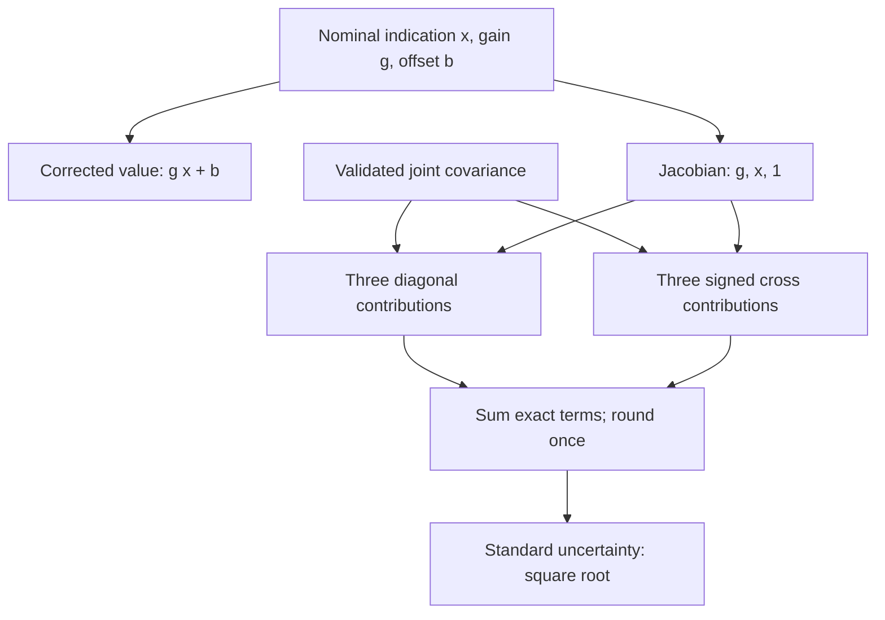
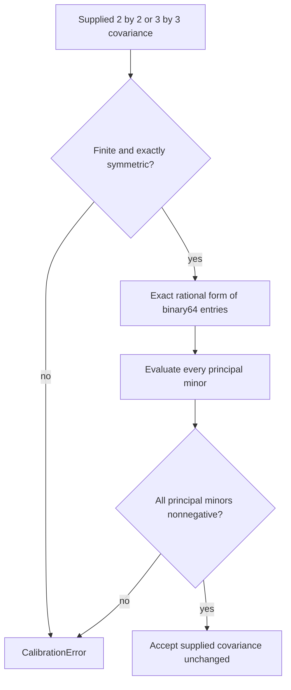

# Numerical semantics

## First-order correlated propagation

For the joint input vector `z=[x,g,b]`, the model is `f(z)=g*x+b`. At the declared nominal values:

\[
J=[g,x,1],\qquad
u_y^2=g^2\sigma_{xx}+x^2\sigma_{gg}+\sigma_{bb}
+2gx\sigma_{xg}+2g\sigma_{xb}+2x\sigma_{gb}.
\]

The budget reports terms named `x`, `g`, `b`, `x:g`, `x:b`, and `g:b`. Cross terms can be negative and are retained. They are covariance contributions, not independently attributable nonnegative uncertainties. Every budget contribution and the output variance has output-unit-squared units. Standard uncertainty is the nonnegative square root of the variance. No expanded uncertainty or confidence/coverage probability is asserted.

Solid arrows show the implemented first-order budget. Signed cross terms may reduce or increase total variance. The nominal corrected value and the propagated uncertainty remain distinct outputs; no distribution or coverage factor is inferred.

## What is approximate

The model is affine in `x` with fixed coefficients. It is nonlinear in the joint uncertain vector because it contains `g*x`. MCUR evaluates the nominal value at the declared nominal inputs and propagates only first-order uncertainty.

For example, if `[x,g,b]` is jointly Gaussian and the supplied nominal values are its means, the exact output mean includes `Cov(x,g)`, and its exact variance includes the additional term `Var(x)*Var(g)+Cov(x,g)^2`. MCUR does not add those terms or assume Gaussianity. In the synthetic replay the nominal result is 7 and the first-order variance is 22.35. Under that additional Gaussian assumption the exact mean would be 7.2 and exact variance 23.39. This comparison states the approximation boundary; the package does not claim a full distributional propagation.

## Covariance eligibility at small scales

Both the profile coefficient covariance and the full joint covariance must be finite, exactly symmetric, and positive semidefinite as represented in binary64. Validation performs all principal-minor checks with exact rational arithmetic over the supplied binary64 values. For these bounded two- and three-dimensional matrices this avoids scale-dependent absolute tolerances, underflowed determinants, eigensolver sign noise, and silent eigenvalue clipping.

This strict policy intentionally rejects a rounded matrix that is slightly indefinite even if its unrounded generating construction was theoretically PSD. The caller must supply a valid covariance or explicitly perform and record its own numerical correction upstream. MCUR does not modify the supplied matrix. Exact singular PSD matrices and exactly zero covariance are supported.

NumPy handles input array shape normalization; Python `Fraction` supplies exact arithmetic for the bounded checks and scalar propagation. This is a small scientific reference operation, not a large-matrix solver or a throughput claim.

The quadratic form and nominal affine calculation are evaluated over exact rational representations and rounded once to binary64. Budget terms are separately rounded, so their displayed sum may differ from the displayed variance by floating-point roundoff. A nonzero quantity that underflows to zero, or a quantity that overflows, raises `CalibrationError`; it is not replaced with a plausible-looking zero or infinity. Rescaling must be explicit in a new input profile and covariance.

Solid arrows show the implemented covariance eligibility check. Exact singular PSD matrices are accepted; a negative principal minor is rejected even at very small scales. This validates the supplied numbers, not the physical uncertainty model.

## Validation fixtures

Tests cover the complete analytical correlated budget, event-time boundaries, later withdrawal and active-status separation, identity/unit mismatch, environmental applicability, coefficient-block consistency, singular correlated cancellation, tiny asymmetric/indefinite matrices, a matrix failing only the three-by-three determinant check, nonfinite values, subnormal positive variance, output overflow/underflow, immutable input records, and pinned SET export conformance.

These are synthetic mathematical and contract tests. They do not validate a physical sensor, environmental model, calibration laboratory, or uncertainty-estimation procedure.
