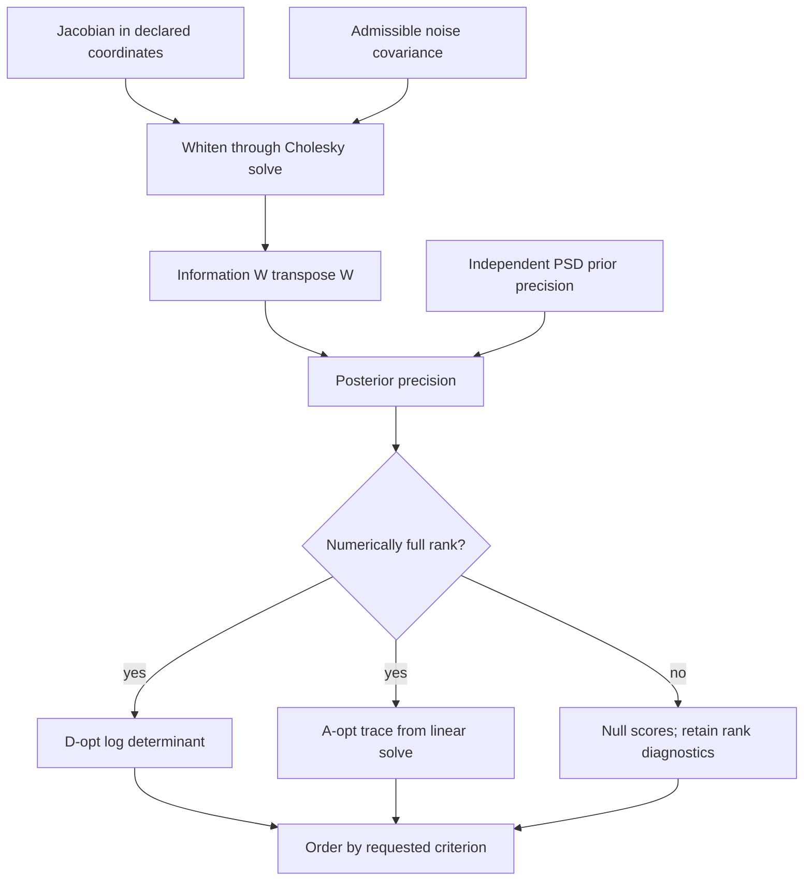

# Numerical scope and validation

## Information accumulation and score eligibility

Solid arrows show the current method for each alternative. Both scores are
computed only after the posterior passes the numerical rank gate; the requested
criterion selects the ordering. Prior addition assumes independent information
in identical parameter coordinates. A singular posterior is unscored rather
than silently reduced through a pseudoinverse; invalid inputs refuse the call.

All computations use float64. Real, finite numerical arrays are required. Complex, Boolean, and string inputs are rejected rather than coerced into physical numbers.

Supplied covariances and priors must be exactly symmetric as stored. No averaging, clipping, or jitter repairs an input. Every diagonal entry must be nonnegative, including entries tiny relative to other coordinates. A zero diagonal requires its entire row and column to be exactly zero. These checks prevent a global matrix scale from hiding a negative variance or forbidden covariance.

PSD validation operates on dimensionless correlation coordinates using square roots of the positive diagonal entries. Each entry is divided by the larger root first, then the smaller root, avoiding products that could overflow for mixed units. Eigenvalues below `-64 × machine_epsilon × dimension × max(abs(eigenvalues))` are rejected. Roundoff-sized negative correlation eigenvalues are tolerated without clipping or changing the supplied matrix. Noise covariance additionally requires all diagonal entries to be positive and its normalized correlation matrix to admit a Cholesky factorization. Physically valid mixed measurement scales such as `diag(1e-20, 1)` are supported.

For `R = D C D`, where `D` contains standard deviations and `C` is the normalized correlation matrix, a Cholesky factorization `C = L Lᵀ` and a linear solve form `W = L⁻¹ D⁻¹ J`. Candidate information is the Gram matrix `WᵀW`. The implementation does not explicitly invert a covariance. Prior precision is added only under the stated independence assumption.

The computed posterior precision is checked for symmetry without averaging and normalized by its maximum absolute entry. Its eigenvalue threshold, `64 × machine_epsilon × dimension × max(abs(eigenvalues))`, defines numerical rank in the declared parameter coordinates. This coordinate-dependent information-rank policy is separate from supplied covariance eligibility. A full-rank posterior uses `slogdet` on normalized precision plus the scale contribution for its log determinant. Its covariance trace comes from a solve against the identity, adjusted by scale. A singular posterior is never scored with a pseudoinverse: this would silently discard unidentifiable directions and change the objective.

Scaling all entries of a well-conditioned covariance to a tiny or large magnitude does not itself make it invalid. Numerical condition, representability, and floating-point underflow still matter. Unrepresentable information or score calculations fail explicitly instead of emitting NaN or infinity. Computations below float64 resolution can lose information; this package does not provide arbitrary precision or rigorous interval bounds.

Both objectives depend on parameter-coordinate conventions. A-opt trace in particular mixes coordinate variances, so a scientifically meaningful common scaling must be supplied. The package checks metadata equality, not whether the chosen scaling expresses a valid engineering utility function. D-opt rankings under a shared nonsingular linear reparameterization have a mathematical relationship, but this implementation makes no general parameter-unit-invariance guarantee and requires exact metadata agreement.

The tests cover analytic full-rank and singular cases, a correlated covariance with a known inverse, complementary prior information, distinct A/D preferences, exact tie handling under candidate permutations, nonmutation, coordinate mismatches, tiny/large scales, and invalid/nonfinite inputs. They establish bounded numerical behavior, not validity of an actual sensor installation or materials experiment.
