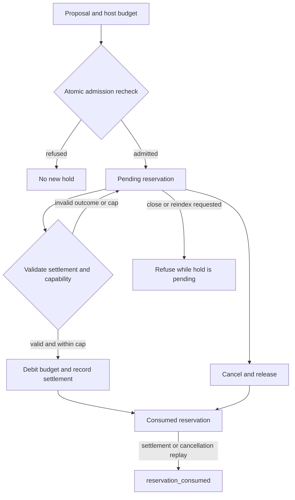

# Yield Weighted Inference Runtime in the instrumentation stack

Notation Systems develops computational instrumentation and evidence infrastructure for industrial and cyber-physical systems.
This component owns **inference-budget admission and settlement**. The [stack map](https://github.com/giasonpooni/Computational-Instrumentation-Workbench/blob/main/docs/STACK.md) locates all public components and distinguishes implemented paths from specifications and scaffolds.

## Current boundary

| Property | Scope |
| --- | --- |
| Implementation | Executable runtime in development |
| Workbench connection | Deterministic advisory token-admission API for CIW observation-design selection; exact revisions are pinned by the consuming profile. |
| Inputs | Caller-declared proposals, department budgets, reuse/yield observations and settlements. |
| Outputs | Admission, refusal or composition decisions, budget state and receipts. |

The runtime evaluates supplied observations; it does not measure model intelligence or scientific truth, execute a model, or authorize equipment.

`evaluate_token_admission` binds explicit inference-token advice to a retained
EDSPT selection and selected candidate. `replay_token_admission` reexecutes the
advice and checks complete content. This disposable advisory context does not
reserve tokens or restore a live host. EDSPT retains observation-cost authority.
See the [adapter contract](OBSERVATION_DESIGN_ADMISSION.md).

## Reservation identity and refusal

Solid arrows describe the implemented process-local lifecycle. A reservation
binds host, loop, base, proposal content, decision occurrence, department and cap.
Validation or store-preparation failure leaves a valid pending hold intact;
foreign or missing capabilities are refused without becoming pending holds.
Settlement, cancellation, proposal and decision identities remain distinct.
Receipts and snapshots report state but cannot restore or replace a capability.
This graph does not imply durable recovery, provider billing, cross-process
coordination, or execution of a scientific instrument.

See the [diagram atlas](https://github.com/giasonpooni/Computational-Instrumentation-Workbench/blob/main/docs/DIAGRAMS.md) for the wider system.

## Interoperability

Integrations use the component's documented contract and an explicit adapter. They preserve source observations, ordered quantities, units, coordinate/frame meaning, time semantics, missingness and declared uncertainty where applicable. An unimplemented field or conversion must be reported as unsupported rather than silently inferred.

Evidence identity names the source record; operation identity names the versioned computation; execution identity names an invocation; result identity names its output; verification identity names a scoped check. These are integration requirements, not a claim that every standalone repository already implements all five record types.

Display names and repository locations do not rename packages, schemas, operation IDs, retained corpus keys or historical runtime pins. CIW integrations use the exact source revisions named in its runtime manifests and operating guides; a provider's current default branch is not a substitute for that binding. Published numerical records retain their original run scope.

## Technical references

- [Overview and runnable instructions](../README.md)
- [docs/KERNEL.md](KERNEL.md)
- [docs/METHODS.md](METHODS.md)
- [docs/SCOPE.md](SCOPE.md)

Private customer state, deployment configuration and calibration knowledge are outside this public component description. Applicable repository licenses and source-data rights remain controlling; a shared stack identity is not a license grant or a change of repository visibility.
