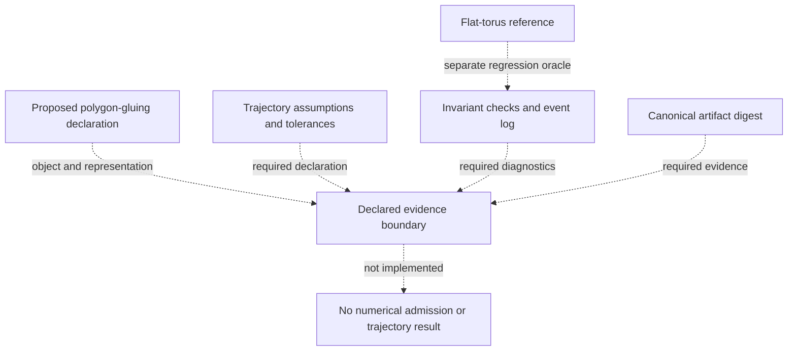

# Translation Surface Dynamics Explorer in the instrumentation stack

Notation Systems develops computational instrumentation and evidence infrastructure for industrial and cyber-physical systems.
This component owns **trajectory dynamics on translation surfaces**. The [stack map](https://github.com/giasonpooni/Computational-Instrumentation-Workbench/blob/main/docs/STACK.md) locates all public components and distinguishes implemented paths from specifications and scaffolds.

## Current boundary

| Property | Scope |
| --- | --- |
| Implementation | Planned scaffold; metadata checks only |
| Workbench connection | No numerical implementation or adapter |
| Inputs | Proposed subject: polygon gluings and declared trajectories on translation surfaces. |
| Outputs | Current deliverable: project declaration, scope and scaffold checks. |

It does not yet implement polygon-gluing dynamics. The executable flat-torus reference covers a narrower mathematical object.

## Declared evidence boundary

Dotted arrows show declared evidence obligations and the documented external reference role; they are not an implemented dynamics pipeline or admission gate. The object, coordinate representation and trajectory assumptions remain distinct. The flat-torus implementation is a separate regression oracle, not code duplicated here. This scaffold provides neither Jacobi propagation nor covariance geometry or triangle-mesh geodesics.

[Instrumentation diagram atlas](https://github.com/giasonpooni/Computational-Instrumentation-Workbench/blob/main/docs/DIAGRAMS.md).

## Interoperability

Integrations use the component's documented contract and an explicit adapter. They preserve source observations, ordered quantities, units, coordinate/frame meaning, time semantics, missingness and declared uncertainty where applicable. An unimplemented field or conversion must be reported as unsupported rather than silently inferred.

Evidence identity names the source record; operation identity names the versioned computation; execution identity names an invocation; result identity names its output; verification identity names a scoped check. These are integration requirements, not a claim that every standalone repository already implements all five record types.

Display names and repository locations do not rename packages, schemas, operation IDs, retained corpus keys or historical runtime pins. CIW integrations use the exact source revisions named in its runtime manifests and operating guides; a provider's current default branch is not a substitute for that binding. Published numerical records retain their original run scope.

## Technical references

- [Overview and runnable instructions](../README.md)
- [docs/SCOPE.md](SCOPE.md)
- [CONTRIBUTING.md](../CONTRIBUTING.md)

Private customer state, deployment configuration and calibration knowledge are outside this public component description. Applicable repository licenses and source-data rights remain controlling; a shared stack identity is not a license grant or a change of repository visibility.
