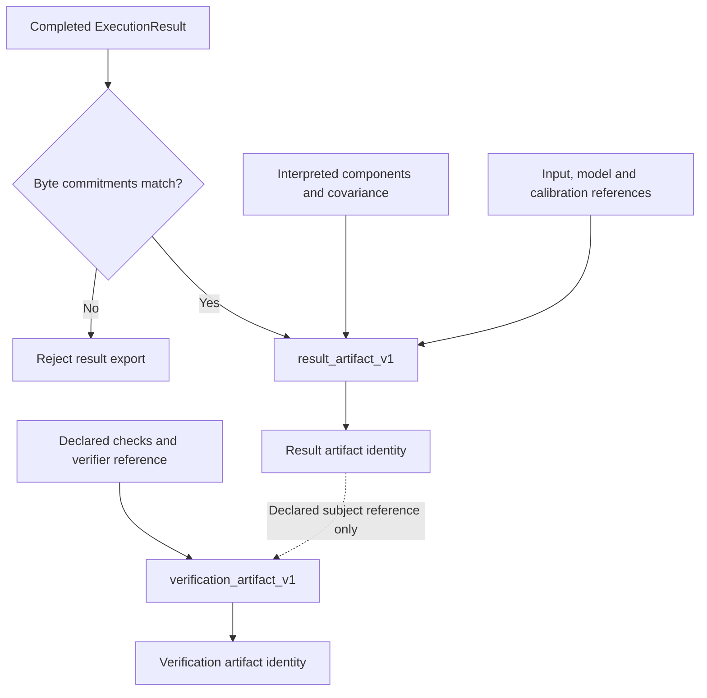
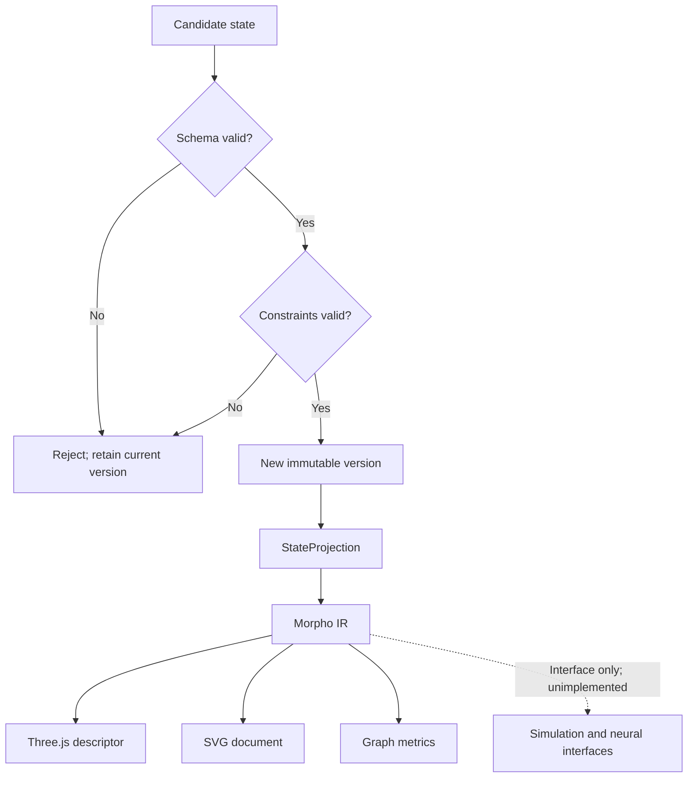

# Scientific Computation Runtime in the instrumentation stack

Notation Systems develops computational instrumentation and evidence infrastructure for industrial and cyber-physical systems.
This component owns **scientific workload execution and verification records**. The [stack map](https://github.com/giasonpooni/Computational-Instrumentation-Workbench/blob/main/docs/STACK.md) locates all public components and distinguishes implemented paths from specifications and scaffolds.

## Current boundary

| Property | Scope |
| --- | --- |
| Implementation | Executable runtime and state/evidence packages; backend-specific prerequisites |
| Workbench connection | Read-only exchange inspection; no execution adapter |
| Inputs | Versioned scientific state, declared computation specifications, explicit inputs and engine bindings. |
| Outputs | Computed artifacts, execution traces and verification artifacts for supported workload/backend combinations. |

Execution, proof verification and physical validity are different claims. Existing state packages keep their admission boundary; the runtime is not a universal owner of other repositories' state.

## Execution records and state projections

The exchange builders preserve separate result and verification identities.
Solid arrows are local builder inputs and outputs. The dotted edge is a
declared subject reference only: `verification_artifact_v1` packages supplied
check outcomes and does not run a verifier.

Commitment recomputation binds supplied execution bytes; the component
interpretation remains caller-declared and covariance numerics remain
`unchecked`. A verification artifact's declared outcome or independence flag
does not authenticate a verifier. Operation occurrences, result claims and
admitted evidence retain their own identities.

The canonical-state compiler is another implemented local subsystem. Its solid
arrows show the validation and projection path, with no backend writeback.
Dotted edges are explicitly unimplemented backend interfaces, not engines.

The evidence pool is a separate subsystem and this figure adds no path from
unreviewed evidence to canonical state. Sources:
[`execution/instrumentation.py`](../execution/instrumentation.py),
[`execution/dispatcher.py`](../execution/dispatcher.py), and
[the compiler architecture](ARCHITECTURE.md). [Diagram atlas](https://github.com/giasonpooni/Computational-Instrumentation-Workbench/blob/main/docs/DIAGRAMS.md).

## Interoperability

Integrations use the component's documented contract and an explicit adapter. They preserve source observations, ordered quantities, units, coordinate/frame meaning, time semantics, missingness and declared uncertainty where applicable. An unimplemented field or conversion must be reported as unsupported rather than silently inferred.

Evidence identity names the source record; operation identity names the versioned computation; execution identity names an invocation; result identity names its output; verification identity names a scoped check. These are integration requirements, not a claim that every standalone repository already implements all five record types.

Display names and repository locations do not rename packages, schemas, operation IDs, retained corpus keys or historical runtime pins. CIW integrations use the exact source revisions named in its runtime manifests and operating guides; a provider's current default branch is not a substitute for that binding. Published numerical records retain their original run scope.

## Technical references

- [Overview and runnable instructions](../README.md)
- [docs/README.md](README.md)
- [docs/ENGINE_SEAM.md](ENGINE_SEAM.md)
- [docs/ARCHITECTURE.md](ARCHITECTURE.md)

Private customer state, deployment configuration and calibration knowledge are outside this public component description. Applicable repository licenses and source-data rights remain controlling; a shared stack identity is not a license grant or a change of repository visibility.

## Read-only exchange path

CIW's [instrument-exchange inspector](https://github.com/giasonpooni/Computational-Instrumentation-Workbench/blob/main/docs/EXCHANGE.md)
checks supported `notation.instrument.*.v1` acquisition/runtime artifacts with
an explicitly pinned State Estimation Evaluation Testbed validator. It retains
full or explicitly unknown covariance and reports content/reference checks.
This is read-only conformance inspection: it does not import a native workspace,
run a scientific provider, admit source evidence or authenticate verification.
The operating guide records the producer/checker revisions and exact limits.
