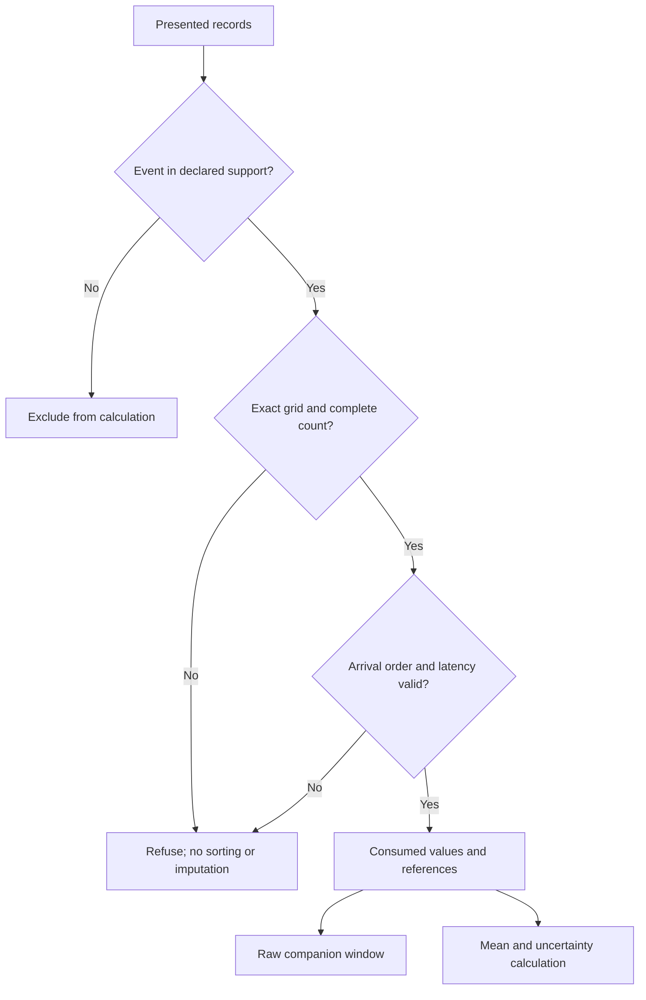
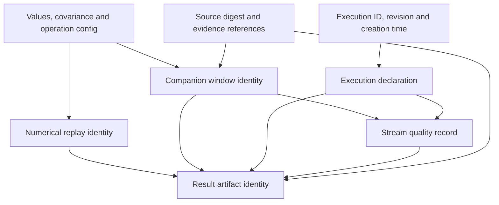

# Stack role: signal-domain feature computation

The implemented operation maps a bounded scalar telemetry window to an arithmetic mean, propagated or unknown covariance, and stream-quality diagnostics. Its scope is downstream of retained acquisition and upstream of optional estimation.

| Concern | Authority |
| --- | --- |
| Source capture, observation bytes and missingness | PPDA / RCI / owning evidence subsystem |
| Declared scalar window mean | STFE |
| Clock mapping and calibration applicability | Referenced mapping/calibration owner; not inferred by STFE |
| Geometry and coordinate transformations | GTE or another declared geometry operation |
| Latent-state estimation and fusion | [Geometric State Inference Engine](https://github.com/giasonpooni/Geometric-State-Inference-Engine) or a domain estimator |
| Declared-constraint reconciliation | CBSR |
| Exchange eligibility and separately implemented evaluation | SET |
| Session composition, provider pins and replay inspection | CIW |
| Scientific workload execution identity | SCR where an actual declared workload is bound |
| Evidence admission and governed state | ESM |

An STFE mean is a deterministic feature, not a corrected source observation or latent-state estimate. Its covariance is conditional on the complete supplied covariance and linear feature map. Clock/frame mapping references are retained but do not themselves prove mapping validity. A source-batch digest is a supplied content binding, not authentication.

## Causality and identity diagrams

The selection conditions are implemented in `window_mean`. Solid arrows group
the local checks and outputs; they do not specify exception precedence. An
excluded record never contributes to this mean.
Malformed record shape or unreadable event time is still refused before
exclusion can be established.

Support is half-open; timing must satisfy `end <= received_by <= decision_time`.
Source storage remains the acquisition owner's responsibility. This diagram
does not imply that STFE stores the excluded source bytes.

The identity diagram shows implemented content bindings. Solid arrows mean
one record contributes fields or references to another, not that their
identities become interchangeable. The numerical replay identity excludes
execution occurrence, source-batch digest and source/calibration references;
the generic result binds those fields as well.

The receipt retains every companion needed to inspect those bindings. The
execution declaration is caller-supplied rather than an SCR commitment;
`nominal_under_declared_grid` is not physical validity. No verification
artifact is minted, and no evidence admission follows from a result hash.
Sources: [`stfe/window.py`](../stfe/window.py) and
[the executable contract](CONTRACT.md). [Diagram atlas](https://github.com/giasonpooni/Computational-Instrumentation-Workbench/blob/main/docs/DIAGRAMS.md).

## Implemented interoperability

`stfe.window_mean` returns a companion receipt and the existing `notation.instrument.result-artifact.v1` projection. Known and unknown covariance projections are tested against SET. Optional integration tests exercise CIW's read-only exchange inspector; that inspector's source pin is enforced by CIW.

The local CLI is a bounded subprocess boundary suitable for a pinned CIW adapter. CIW owns composed session persistence and provider provenance. STFE does not import sibling instrument kernels, write ESM state, spend YWIR budgets or claim independent verification. The three geometry scaffolds are not dependencies.

The public contract is the bounded window mean currently present in source and tests. FFT/STFT, C++ kernels, offline modes, active buffers, multichannel estimators, GNSS/RTK signal models and hardware qualification are not implemented capabilities here.

## Public/private boundary

Public material consists of reusable operations, implemented contracts, synthetic fixtures and reproducible conformance tests. Customer telemetry, deployment configuration, proprietary calibration profiles, private thresholds, agent prompts and internal plans remain outside this interface.
