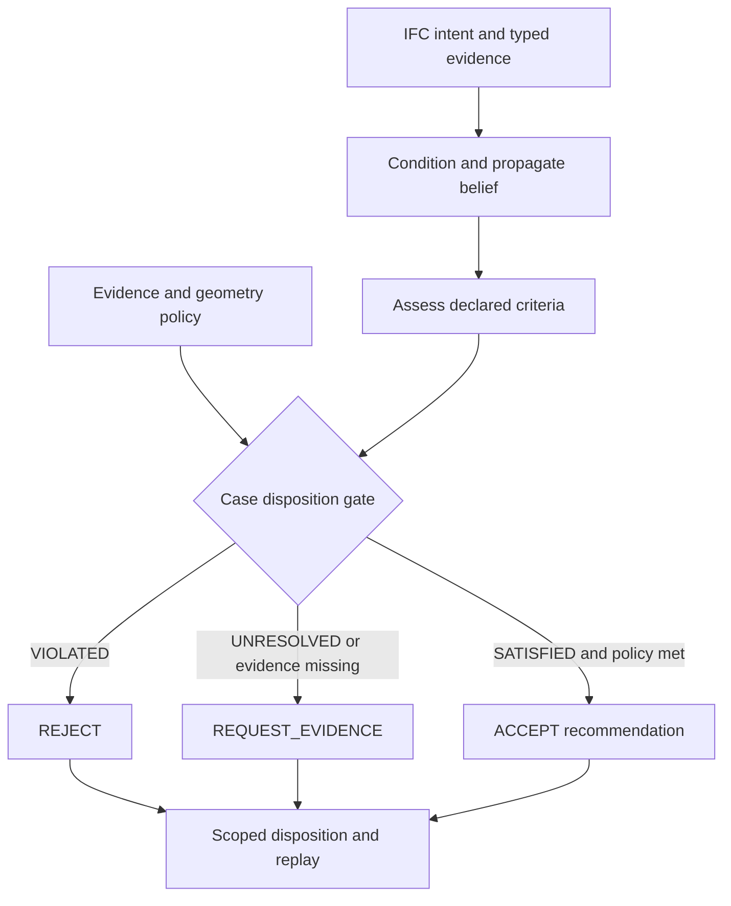
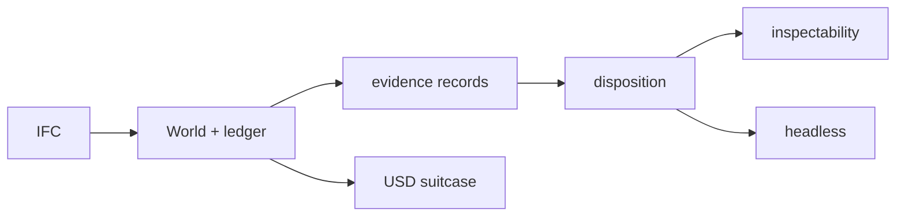

# State Estimator for BIM

Part of **Notation Systems' computational instrumentation and evidence infrastructure** for industrial and cyber-physical systems.

[Notations Engineering Terminal (CIW)](https://github.com/giasonpooni/Notations-Engineering-Terminal) · [Diagram atlas](https://github.com/giasonpooni/Notations-Engineering-Terminal/blob/main/docs/DIAGRAMS.md) · [Stack map](https://github.com/giasonpooni/Notations-Engineering-Terminal/blob/main/docs/STACK.md) · [Component role and interfaces](docs/STACK_ROLE.md)

Portable **evidence-to-decision** runtime for BIM. CSE compiles IFC design
intent into an auditable architectural belief, conditions that belief on
physical evidence, and returns a fail-closed disposition:



The disposition records its assessed world and policy. `ACCEPT` is a
recommendation, not construction approval; a safe BIM prior alone does not
satisfy an as-built evidence requirement.

Current project title: **State Estimator for BIM**. **Construction State
Estimator (CSE)** remains the engine name and historical title. Python package:
`gat-bim`. Import and CLI: `gat` (historical engine namespace; not a learned
neural Transformer). OpenUSD is an optional signed restart carrier, not the
product. Naming changes do not rewrite model, evidence, disposition, execution,
verification, or retained runtime identities.

It is **not** a learned model, a Revit replacement, an FEM solver, or a
digital-twin platform.

Status: experimental v0. License: MIT. Core dependency: `numpy`.

Architecture, scope, and historical naming are documented in
[`docs/treatise.md`](docs/treatise.md).
Component relationships: [`docs/MAP.md`](docs/MAP.md).

## Loop

```text
IFC design intent + physical evidence
    → posterior architectural belief
    → SATISFIED / VIOLATED / UNRESOLVED
    → stop, or select the next worthwhile measurement
    → condition → propagate → verify → export
```



First deployment slice: construction acceptance (as-built clearance,
prefabrication / opening fit, design-change impact). A case is never accepted
because the BIM prior looks safe. Every satisfied check needs calibrated
evidence bound to the same world, and enough **geometry authority** to justify
the check.

## Install

```bash
git clone https://github.com/giasonpooni/State-Estimator-for-BIM.git
cd State-Estimator-for-BIM
python -m pip install -e .
python -m unittest discover
python -m gat.demo.workflow
python -m gat.demo.beam_assurance out/beam
python -m gat.demo.experiment_harness --demo -o out/harness-bundle.json
gat-headless request.json -o response.json
```

`--demo` binds the shipped instrument and torus *fixtures* to the Beam-B1
pin. Those fixtures are not field evidence. Python 3.12+.

Optional extras after the editable install:

```bash
python -m pip install -e ".[openusd]"      # Pixar OpenUSD carrier + signatures
python -m pip install -e ".[ifcopenshell]" # second IFC inventory adapter; not the authoritative loader
```

## Experiment across tools

Command map for every companion: [`docs/experiment-index-v1.md`](docs/experiment-index-v1.md).
Harness contract: [`docs/experiment-harness-v1.md`](docs/experiment-harness-v1.md).

Each companion repo stays its own clone. Do not submodule them.

```bash
# After clone of this repo only:
python -m gat.demo.experiment_harness --demo -o out/harness-bundle.json

# Live records from the other clones, then bind:
python -m gat.demo.experiment_harness \
  --disposition validation/beam-b1-disposition-v1.json \
  --commit path/to/rci-evidence-commitment.json \
  --commit path/to/torus-first-release-commitment-v1.json \
  -o out/harness-bundle.json
```

The bundle records that those files hashed to those digests. It does not
change Beam-B1. It does not call JSPT. It does not invoke SP1.

JSPT remains the owner of A2–A5. Pin a git SHA and wrap types in domain
code. Do not put `sensitivity` in the guest.

## One decision

`python -m gat.demo.workflow` runs opening fit on the shipped demo IFC and
prints the operational contract:

- as-built policy → `REQUEST_EVIDENCE` (numerical fit is not field evidence)
- explicit design-review policy → `ACCEPT` as a recommendation, not an approval
- RFI preview mutates nothing

Live dispositions from the shipped demo IFC (not an architecture table):

- [`validation/opening-fit-disposition-v1.json`](validation/opening-fit-disposition-v1.json) — `REQUEST_EVIDENCE`
- [`validation/opening-fit-design-review-disposition-v1.json`](validation/opening-fit-design-review-disposition-v1.json) — design-review `ACCEPT`
- [`validation/beam-b1-disposition-v1.json`](validation/beam-b1-disposition-v1.json) — Beam-B1 `SATISFIED` → `VIOLATED` after the material certificate

```python
from gat import GatSession, ObserveQuantity, SetParameter

session = GatSession.load_ifc("gat/demo/model.ifc")
session.run(ObserveQuantity.single(session.var("Office-A", "Volume"), 59.4, 0.05))
session.run(SetParameter(session.var("Level 1", "ClearHeight"), 3.4, design_sigma=0.01))
session.export_ifc("out/model_transformed.ifc")
```

## Honesty (v0)

- Covariance is first-order. Means of derived quantities are exact re-evaluations.
- Dense `float64` covariance is the verified oracle. A sparse belief representation
  is not implemented; resident covariance storage is O(n²).
- The v0 IFC adapter reads quantities and placements, not general solids.
  Beams are `SWEPT_SOLID`, `LENGTH_ONLY`, or `BLOCKED` — never a silent bbox.
- Gaussian clash is a proxy; openings are not subtracted. That support is
  `GAUSSIAN_PROXY` and cannot close an as-built clearance case without scan
  evidence (`SCAN_GMM`) or a later solid adapter.
- A ledger replay proves history on a compatible runtime. An unsigned chain
  does not prove publisher identity.
- A replayable transition commitment binds one accepted step and, when present,
  a **bounded fixed-point arithmetic guest**. It does not prove the Gaussian
  update, the observations, or that the building is safe.
- Determinism is same-platform byte identity.
- A public IFC audit inventories compatibility. It does not authorize a
  decision. See [`docs/real-ifc-validation-v1.md`](docs/real-ifc-validation-v1.md).

## Kernel vs satellites

Frozen for v0.2 unless a change alters a disposition, digest, or replay on
the acceptance / beam / RFI slice. Such a change is a version bump, not a
satellite. See [`docs/kernel-v1.md`](docs/kernel-v1.md).

| Kernel | Satellite |
|---|---|
| IR, Gaussian belief, propagate, verify | Structural attention |
| Typed evidence, decision, acceptance | Splat export, viewer cosmetics |
| Ledger, snapshot, JSON / signed OpenUSD | Blender coloring |
| IFC audit + beam geometry status | SP1 proving service (manual CI) |
| Headless JSON boundary | Learned weights |
| | Experiment harness (digest binding) |

## Docs

- [`docs/treatise.md`](docs/treatise.md) — historical name, architecture, proof language
- [`docs/MAP.md`](docs/MAP.md) — component relationships
- [`docs/geometry-authority-v1.md`](docs/geometry-authority-v1.md)
- [`docs/kernel-v1.md`](docs/kernel-v1.md)
- [`docs/experiment-index-v1.md`](docs/experiment-index-v1.md) — how to try each tool
- [`docs/experiment-harness-v1.md`](docs/experiment-harness-v1.md) — bind companion records
- [`docs/ifcopenshell-adapter-v0.md`](docs/ifcopenshell-adapter-v0.md)
- [`docs/proof-carrying-state-v1.md`](docs/proof-carrying-state-v1.md) — replayable transition commitment
- [`docs/workflow-deployment-v1.md`](docs/workflow-deployment-v1.md)
- [`docs/real-ifc-validation-v1.md`](docs/real-ifc-validation-v1.md) — what a public IFC audit is not

## What CSE is not

Not Revit, Archicad, CAD, a renderer, an LLM, a generic Gaussian package,
FEM, IFC, or a twin platform. It is a computational layer that can sit
between those representations and a decision.

Repository: [giasonpooni/State-Estimator-for-BIM](https://github.com/giasonpooni/State-Estimator-for-BIM).
Previous project locations include `Construction-State-Estimator-for-BIM` and
`BIM-State-Transformer-Engine-WIP`. These remain historical references; use the
current repository location for new links. Engine name remains CSE. Package is
`gat-bim`. Import is `gat`.
