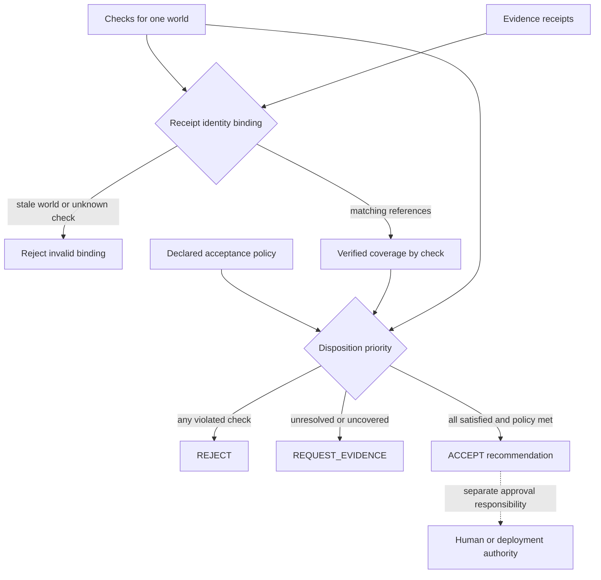

# Construction State Estimator for BIM in the instrumentation stack

Notation Systems develops computational instrumentation and evidence infrastructure for industrial and cyber-physical systems.
This component owns **bim evidence-to-decision computation**. The [stack map](https://github.com/giasonpooni/Computational-Instrumentation-Workbench/blob/main/docs/STACK.md) locates all public components and distinguishes implemented paths from specifications and scaffolds.

## Current boundary

| Property | Scope |
| --- | --- |
| Implementation | Executable experimental BIM runtime |
| Workbench connection | Standalone; companion commitment and numerical adapters |
| Inputs | IFC design intent, typed observations, declared uncertainty and decision criteria. |
| Outputs | Conditioned architectural state, dispositions, replay records and optional exports. |

BIM priors and synthetic fixtures do not establish as-built acceptance. The bounded arithmetic guest does not prove the observations or general building safety.

## Evidence coverage and disposition

Solid arrows summarize the implemented case evaluator in
`gat/workflows/acceptance.py`; the dotted relationship marks authority outside
that evaluator. Receipt eligibility requires the policy’s accepted evidence kind
and verification flag. A stale receipt is an input error, not missing coverage.
The explicit design-review policy can waive as-built evidence; the disposition
retains that policy choice rather than presenting it as verified construction.

See the [diagram atlas](https://github.com/giasonpooni/Computational-Instrumentation-Workbench/blob/main/docs/DIAGRAMS.md) for the wider system.

## Interoperability

Integrations use the component's documented contract and an explicit adapter. They preserve source observations, ordered quantities, units, coordinate/frame meaning, time semantics, missingness and declared uncertainty where applicable. An unimplemented field or conversion must be reported as unsupported rather than silently inferred.

Evidence identity names the source record; operation identity names the versioned computation; execution identity names an invocation; result identity names its output; verification identity names a scoped check. These are integration requirements, not a claim that every standalone repository already implements all five record types.

Display names and repository locations do not rename packages, schemas, operation IDs, retained corpus keys or historical runtime pins. CIW integrations use the exact source revisions named in its runtime manifests and operating guides; a provider's current default branch is not a substitute for that binding. Published numerical records retain their original run scope.

## Technical references

- [Overview and runnable instructions](../README.md)
- [docs/kernel-v1.md](kernel-v1.md)
- [docs/geometry-authority-v1.md](geometry-authority-v1.md)
- [docs/experiment-harness-v1.md](experiment-harness-v1.md)

Private customer state, deployment configuration and calibration knowledge are outside this public component description. Applicable repository licenses and source-data rights remain controlling; a shared stack identity is not a license grant or a change of repository visibility.
