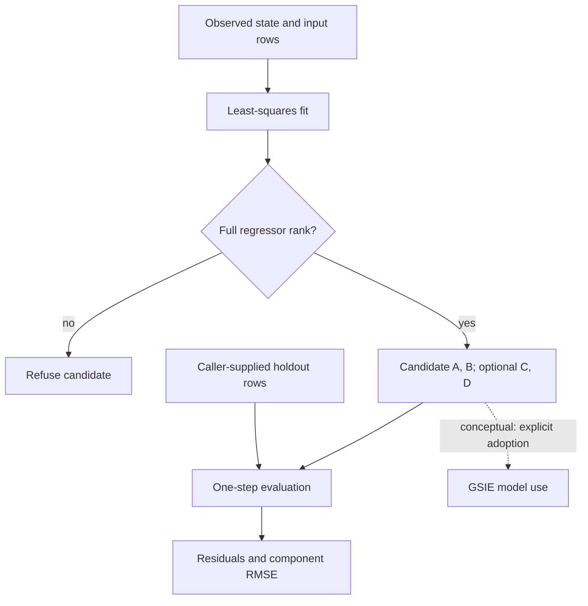

# Dynamics Fitter

**Fit candidate dynamics from observed trajectories and inspect rank, residuals and holdout error.**

| NET micro-tool | Identity and scope |
| --- | --- |
| User-facing name | **Dynamics Fitter** |
| Proposed NET operation | `dynamics.fit` |
| Implementation repository | `System-Identification-Dynamics-Testbed` |
| Existing provider and import | System Identification and Dynamics Testbed / SIDT; `sidt` |
| Existing operations | `sidt.discrete-lti-lstsq.v1` and `sidt.declared-lti-identification.v1` |
| Current boundary | Fully observed, discrete-time linear dynamics; no hidden-state realization identification |

`dynamics.fit` is the agreed NET-facing operation target, **not a newly installed
command or a general nonlinear physics-engine fitting service**. Use the existing
`sidt` functions and examples below. A fitted candidate is not automatically
adopted, proven stable or treated as a physically validated model. Parameter
covariance in the declared identification path remains explicitly unknown.

NET owns session composition and dispatch; this provider owns fitting and its
numerical diagnostics. **Stability Check** and **Observability Check** remain
separate analyses. Evidence, operation specifications, execution attempts and
verification records remain distinct. Repository URLs, imports, operation IDs,
contracts, historical pins and licence terms are unchanged.

[Notations Engineering Terminal (CIW)](https://github.com/giasonpooni/Notations-Engineering-Terminal) · [Stack placement and ownership](docs/STACK.md) · [License](LICENSE)

A bounded scientific instrument for fitting and evaluating **fully observed, discrete-time linear dynamics**. It produces candidate models and diagnostics for review and downstream testing.

Implemented operations: `sidt.discrete-lti-lstsq.v1` and the additive
`sidt.declared-lti-identification.v1` integration boundary.

\[
x_{k+1}=Ax_k+Bu_k, \qquad y_k=Cx_k+Du_k.
\]

The state trajectory must be supplied explicitly. Optional measured output rows permit fitting `C` and `D`. This implementation cannot identify a hidden state realization from inputs and outputs alone.

## Candidate fitting and evaluation



Solid arrows show current local fitting and evaluation calls. Insufficient
excitation can appear as deficient regressor rank; passing this gate does not
prove general excitation or physical identifiability. The caller establishes
holdout independence. The labelled dotted arrow is a conceptual downstream
relationship, not an implemented execution adapter or model-adoption action.
See the [system diagram atlas](https://github.com/giasonpooni/Notations-Engineering-Terminal/blob/main/docs/DIAGRAMS.md).

## Install and run

Requires Python 3.11 or newer.

```bash
python -m pip install -e '.[test]'
python -m pytest
python examples/replay.py
```

The replay constructs a known two-state system, fits it, evaluates a trajectory generated with a separate seed, and prints matrices, rank, singular values, residuals, and holdout error. It performs no network requests or operational state changes.

## API

```python
import numpy as np
from sidt import fit_lti

# Sample rows: states has N+1 rows; inputs has N transition-aligned rows.
x = np.array([[1.0], [0.8], [0.9], [0.52]])
u = np.array([[0.0], [1.0], [-1.0]])
candidate = fit_lti(
    x, u,
    sample_interval=0.1,              # seconds; fixed across the trajectory
    state_names=("temperature_delta",), state_units=("K",),
    input_names=("heater_power",), input_units=("W",),
)
print(candidate.A, candidate.B)
print(candidate.diagnostics.rank)
print(candidate.candidate_digest)
```

Provide `outputs`, `output_names`, and `output_units` together to fit the optional output equation. `candidate.predict_next` and `candidate.predict_output` take matching sample-row matrices. `evaluate_one_step(candidate, states, inputs, outputs=...)` measures supplied one-step residuals; the caller establishes independence from training data.

| Result | Meaning |
| --- | --- |
| `A`, `B`, optional `C`, `D` | Candidate matrices in the declared state/input/output coordinates |
| `metadata` | Fixed sample interval, variable order, unit labels, operation identifier, optional conditioning reference |
| `diagnostics` | Regression rank, singular values, rank cutoff, residual arrays, per-target residual sums of squares, residual degrees of freedom |
| `candidate_digest` | Content identity for matrices, metadata, schema, and numerical rank policy |

Rank-deficient regression raises `NonIdentifiableError` with rank diagnostics and returns no usable model. Finite values, dimensions, nonempty variable labels, and positive sample interval are checked. Units are recorded labels; dimensional consistency and timestamp alignment remain caller responsibilities.

## System role

The [declared identification API](docs/DECLARED_IDENTIFICATION.md) retains
reference-clock times, state frames, ordered coordinates, evidence and sample
references, optional disjoint holdout declarations, and a rank/conditioning
gate. It returns only a conditional `A`/`B` candidate; parameter covariance
remains explicitly unknown. Fresh replay preserves numerical identity while
assigning separate execution and result identities. Run
`python examples/declared.py` for the complete synthetic example.

PPDA supplies observations and provenance. STFE may condition streams; its operation/result reference belongs in `conditioning_reference`, with full records retained externally. SIDT fits a candidate. GSIE may evaluate that candidate as an explicitly selected dynamics model; OIT may inspect observability for the declared `A` and `C`; SET can test estimation behavior and model mismatch. Notations Engineering Terminal (CIW) owns cross-repository execution around the declared operation; model adoption remains an explicit downstream decision.

SIDT owns the fit and its numerical diagnostics. It does not own evidence truth, canonical state, model adoption, admission, policy, observer tuning, or actuation. A successful fit and a digest do not establish physical validity, causal validity, stability, or operational authority.

Read [the contract](docs/CONTRACT.md), [numerical assumptions](docs/NUMERICS.md), and [stack boundaries](docs/STACK_ROLE.md).

## Optional SET conformance export

```bash
python -m pip install -e '.[test,exchange]'
python examples/exchange.py
```

The optional dependency is pinned to SET revision `bd261a765281a95312f7c91a3857233476294c5b`. `sidt.exchange.export_result` maps explicitly supplied JSON values into SET's existing `notation.instrument.result-artifact.v1` contract and invokes its validator. The example maps the actual fitted matrices into ordered coefficient components, includes full input and numerical-result records, and marks parameter covariance `unknown`. Its timestamps, evidence/execution references, and all-zero source revision are clearly synthetic caller declarations.

This is a conformance export. It does not authenticate provenance, establish independent verification, adopt the candidate, or provide a native CIW execution adapter. Exchange tests skip when the optional validator package is absent; they run when the `exchange` extra is installed.

## License

MPL-2.0. See [LICENSE](LICENSE).
