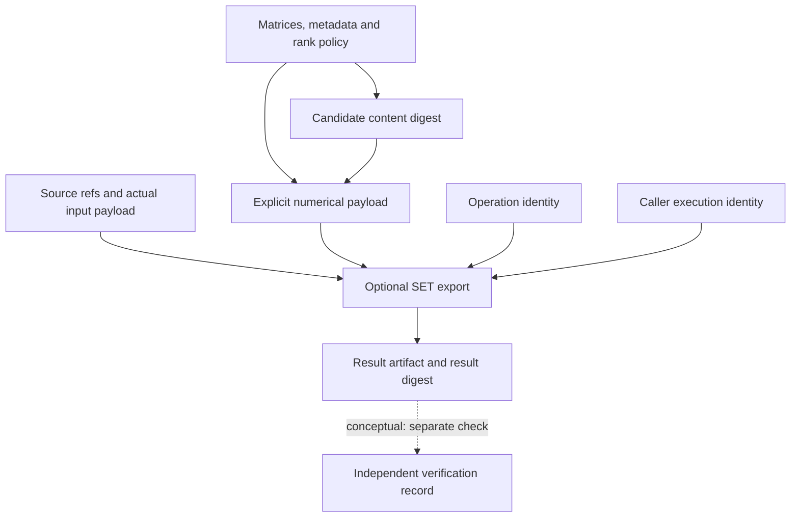

# Input, result, and identity contract

This document describes the original `fit_lti` and optional export contracts.
The additive [declared identification operation](DECLARED_IDENTIFICATION.md)
retains and validates reference times, state frames, evidence partitions, and
conditioning limits while preserving these existing APIs.

## Input alignment

For `N` transitions, `n` observed state components, `m` inputs, and `p` optional outputs:

| Field | Shape / rule |
| --- | --- |
| `states` | `(N+1, n)`, rows `x[0]` through `x[N]`; `N >= 1`, `n >= 1` |
| `inputs` | `(N, m)`, row `u[k]` acts on the transition `x[k] -> x[k+1]` |
| `outputs` | Optional `(N, p)`, `p >= 1`; row `y[k]` is paired with `x[k]` and `u[k]`, not `x[k+1]` |
| `sample_interval` | Finite positive seconds, fixed throughout the trajectory |
| `*_names` | Ordered unique, nonempty strings, one per component |
| `*_units` | Ordered nonempty unit-label strings, one per component; use `"1"` for dimensionless quantities |
| `conditioning_reference` | Optional nonempty reference to an externally retained conditioning result |
| `rcond` | Optional finite relative singular-value cutoff strictly between zero and one |

An autonomous model uses an `(N, 0)` input matrix and empty input metadata tuples. Matrices must contain finite real numeric values. Booleans, strings, complex values, one-dimensional arrays, and implicit shape broadcasting are refused. Input arrays are copied; fitting and evaluation do not mutate them. Returned numeric arrays have immutable bytes backing.

No timestamps are consumed by this API. Supplying `sample_interval` asserts uniform timing; it does not verify it. The caller must preserve source timing, state coordinate definitions, unit conversions, preprocessing, calibration applicability, and synchronization records externally. All state components are observations or explicit externally produced state inputs; an estimated state must retain its upstream estimation identity and associated limitations.

## Outputs and refusal

`fit_lti` returns a `DynamicsCandidate` with `A`, `B`, optional `C` and `D`, `ModelMetadata`, `FitDiagnostics`, and `candidate_digest`.

Residuals use **observed minus predicted**. State residual rows correspond to `x[k+1]`; output residual rows correspond to `y[k]`. Residual sums of squares are reported separately for each target component, so mixed physical units are not combined into a scalar score. `degrees_of_freedom` is `N - rank(Z)` per fitted target column.

Rank deficiency raises `NonIdentifiableError`; its `diagnostics` records the sample count, regressor count, rank, singular values, threshold, and residual degrees of freedom. Residual and model fields are not exposed for a refused fit. Invalid input raises `ValueError`. SVD convergence failure propagates `numpy.linalg.LinAlgError`; nonfinite computed values are refused. There is no regularization fallback, silent pseudoinverse acceptance, coercion to a stable matrix, or covariance estimate.

`evaluate_one_step` returns a `OneStepEvaluation`: candidate digest, sample count, residual matrices, and per-component RMSE. The caller must supply the same sample interval, coordinates, units, and conditioning convention as the candidate. The evaluator checks matrix shape and numeric finiteness, but cannot prove that a dataset is independent, correctly timed, or held out. It does not refit the model or recursively propagate a trajectory.

## Model identity and exported execution identity

Solid arrows show current content binding when the caller invokes the optional
exporter. The candidate digest identifies model content; it excludes source
data and is not an execution identity. The result digest includes the declared
execution identity. Source references and the supplied revision are not
authenticated by export. The labelled dotted relationship requires a separate
verifier; exported verification references start empty.

## Identity separation

The candidate digest is SHA-256 over UTF-8 JSON with sorted keys, compact separators, finite numeric values, matrices, metadata, schema `sidt.dynamics-candidate.v1`, and the effective relative rank cutoff. It excludes residuals and source data. Equal model content may result from distinct evidence and executions. Different platforms may yield slightly different floating-point matrices and therefore different digests.

| Identity | Authority / handling |
| --- | --- |
| Evidence identity | Supplied by acquisition and retained outside the model digest; SIDT does not authenticate it |
| Operation identity | `sidt.discrete-lti-lstsq.v1`; identifies the bounded method |
| Execution identity | Assigned to a specific run by the invoking runtime; a candidate digest is not a run ID |
| Result identity | `candidate_digest` identifies the computed candidate content |
| Verification identity | Assigned to an independent verification record; neither fit residuals nor a digest imply verification |

The Python data classes are result containers, not trust-boundary validators for manually constructed objects. The documented guarantees apply to values produced by `fit_lti` and `evaluate_one_step`. No admission, model adoption, persistence to canonical state, or external execution is performed.

## Optional result-artifact export

`sidt.exchange.export_result` validates explicitly mapped JSON through the pinned SET validator. It retains separate operation, execution, input, result, and verification fields. The result-artifact content digest includes execution identity; the candidate digest above identifies model content and remains a distinct nested field. Input content has its own digest. Source revision is caller supplied and marked unattested, and verification references begin empty.

`examples/exchange.py` demonstrates coefficient ordering by matrices `A`, `B`, `C`, `D`, then row, then column. Coefficient unit labels express the row-variable unit divided by the column-variable unit. Covariance status is `unknown` with no matrix; residuals are not relabeled as parameter uncertainty. The example's supplied trajectory must be the trajectory used to fit the candidate. The generic exporter snapshots payloads and validates structural conformance; it does not recompute the fit or attest that correspondence.
