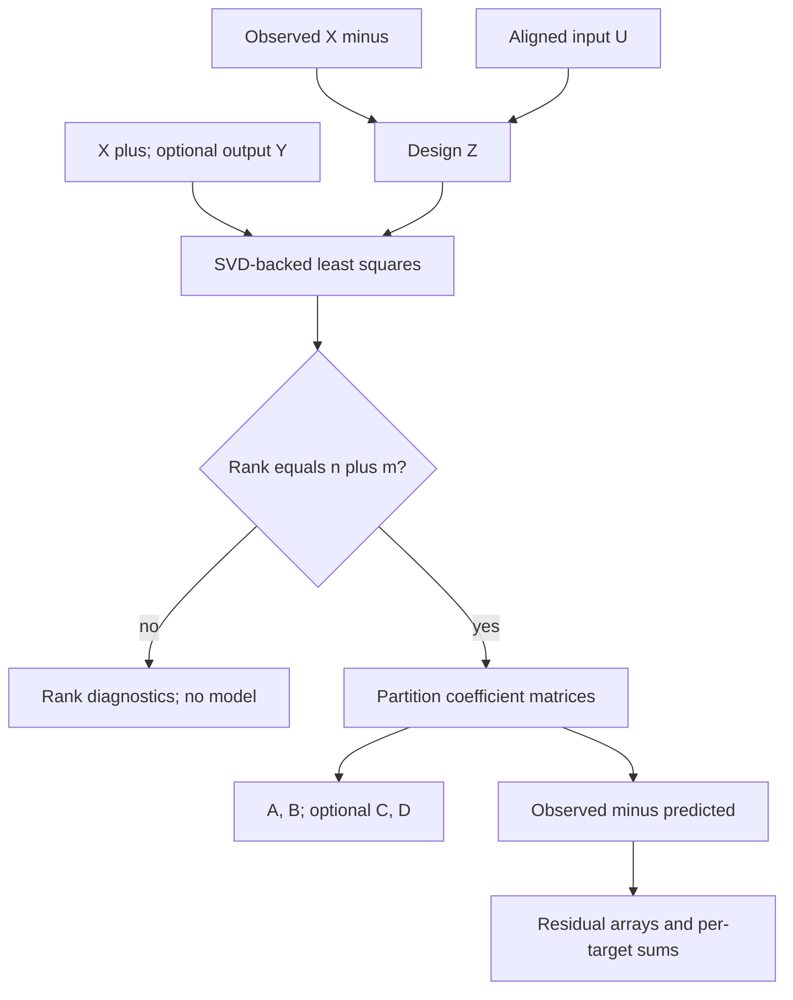

# Numerical method and limits

The implementation solves one linear least-squares problem using NumPy's SVD-backed `lstsq`. Define sample-row matrices:

\[
Z=[X_-\;U], \quad X_-=[x_0^\top;\ldots;x_{N-1}^\top],
\quad X_+=[x_1^\top;\ldots;x_N^\top].
\]

Without output observations, solve `Z @ Theta = X_plus` in least squares, where `Theta = [A.T; B.T]`. With outputs, solve both targets together:

\[
\min_\Theta\|Z\Theta-[X_+\;Y]\|_F^2,
\quad
\Theta=\begin{bmatrix} A^\top&C^\top\\B^\top&D^\top\end{bmatrix}.
\]

Each target column has its own coefficients. The unweighted multi-target formulation does not pool state/output physical units into a decision score. No explicit matrix inverse or normal-equation inversion is used.

## Regression data flow

Solid arrows show the implemented local regression flow. `X minus` means
`states[:-1]`; `X plus` means `states[1:]`. The returned SVD rank is tested before
a candidate is exposed. Residual diagnostics describe the supplied data and
remain separate from parameter uncertainty, stability and external verification.

## Numerical identifiability

The effective relative rank cutoff is the supplied `rcond`, or `float64 epsilon * max(Z.shape)` when omitted. Singular values are assessed by `lstsq` relative to the largest singular value under that cutoff. The result records the effective cutoff and singular spectrum.

Only full column rank, `rank(Z) == n + m`, produces a candidate. A short trajectory, unexcited input, redundant coordinates, or state/input collinearity may make the regression nonidentifiable. Rank is threshold-dependent and coordinate scaling matters. Full numerical rank alone does not establish physical identifiability, persistent excitation beyond the observed dataset, good conditioning, or generalization. Singular values permit the consumer to assess ill-conditioning; there is no hidden scaling or regularization policy.

A full-rank square design matrix is accepted with zero residual degrees of freedom. This may interpolate perfectly; it provides no residual basis for estimating noise. No parameter covariance, process covariance, measurement covariance, confidence interval, or stability certificate is reported.

## Model assumptions

The model is linear, time invariant, discrete time, and has no intercept. Centering is not performed automatically. An affine offset requires an explicitly defined external representation; users must preserve the resulting coordinate semantics. Sampling is asserted to be uniform. Delay, filtering, and resampling can change effective dynamics and must be retained in conditioning records.

The algorithm observes the state coordinates directly. It does not solve output-only realization, subspace identification, latent state estimation, or similarity-transform ambiguity. Least squares can be biased when regressors contain measurement error, when process disturbances correlate with the regressors, or when feedback creates endogeneity. Fit residuals mix noise, mismatch, timing error, and preprocessing effects; they are not automatically physical disturbance observations.

The fit does not enforce stability, passivity, conservation, physical constraints, or unit consistency. Those properties require separate analysis or evidence. Optional `C` and `D` use `y[k]`, `x[k]`, and `u[k]` at the same sample index.

## Evaluation

One-step prediction uses the supplied observed state at every row. It therefore does not establish long-horizon simulation behavior or estimator convergence. The replay uses a separate synthetic seed for a holdout trajectory; this establishes fixture independence only. Real datasets require explicit partition records, leakage checks, and timing evidence supplied by the caller.

Tests cover exact matrix recovery, independent one-step prediction, noisy residual reconstruction and least-squares orthogonality, rank deficiency, insufficient samples, rank-threshold sensitivity, autonomous dynamics, zero residual degrees of freedom, invalid metadata, nonfinite inputs, strict shapes, deterministic same-environment digesting, and input/result nonmutation.

